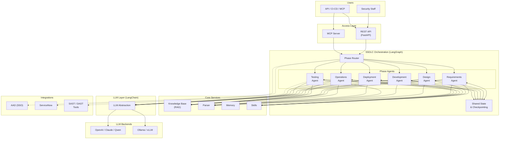
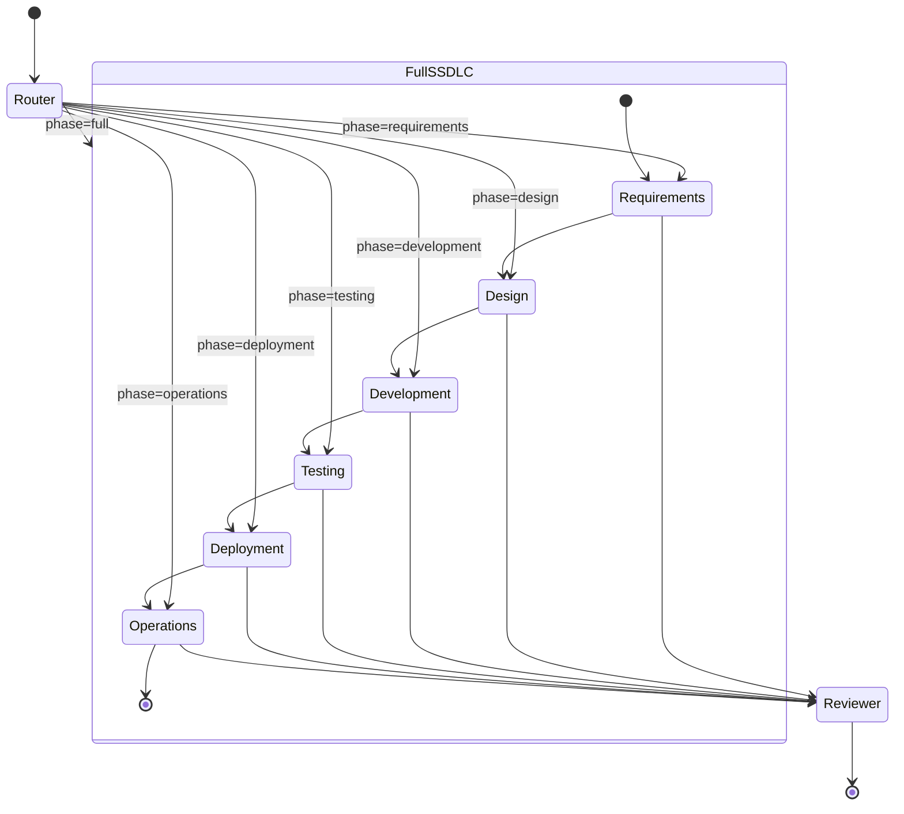
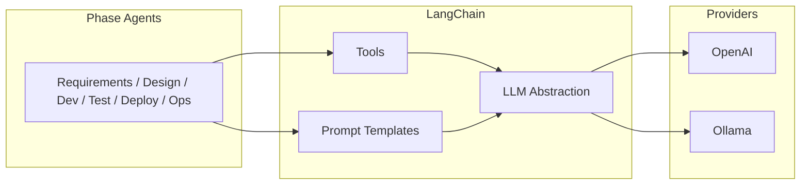
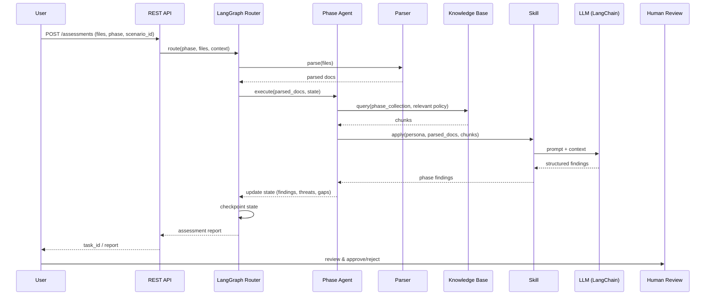
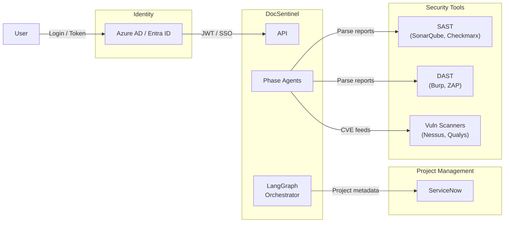
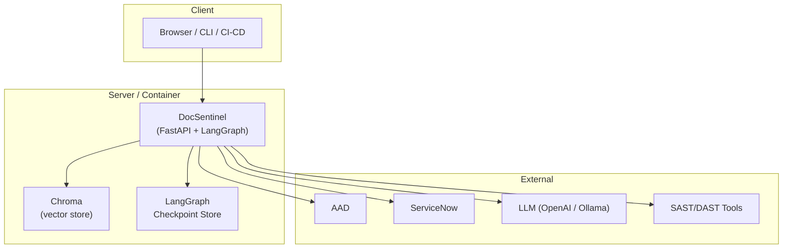

# System Architecture | 系统架构

  

**DocSentinel** — System Architecture Document (open-source style)

|                  |                                                                           |
| :--------------- | :------------------------------------------------------------------------ |
| **Version**      | 4.0                                                                       |
| **Author**       | PAN CHAO                                                                  |
| **Last updated** | 2026-03                                                                   |
| **Related**      | [Product Requirements (PRD)](./SPEC.md) · [Design docs](./docs/README.md) |

---

## Overview | 概述

DocSentinel is an **AI-powered SSDLC (Secure Software Development Lifecycle) platform** that automates security activities across all six phases of the software development lifecycle. Built on **LangChain** and **LangGraph**, the system orchestrates phase-specific AI agents to perform security assessments — from requirements analysis and threat modeling to vulnerability monitoring and incident response. This document describes the **system architecture**: high-level design, components, data flow, integrations, and deployment. For product goals and requirements, see [SPEC.md](./SPEC.md).

---

## Goals & Context | 目标与背景

-   **Goal**: Provide AI-assisted security coverage across the entire SSDLC — Requirements, Design, Development, Testing, Deployment, and Operations — reducing manual effort for security teams while improving coverage and consistency.
-   **Context**: Enterprise security teams must embed security into every phase of delivery (Shift-Left), aligned with frameworks like NIST SSDF, OWASP SAMM, and Microsoft SDL. The system provides phase-specific agents orchestrated by LangGraph, a unified knowledge base (RAG) with phase-specific collections, multi-format parsing, and pluggable LLMs (cloud or local) via LangChain.

---

## High-Level Architecture | 高层架构

The system is organized in layers: **Access** → **SSDLC Orchestration (LangGraph)** → **Core Services (KB, Parser, Memory, Skills)** → **LLM Abstraction (LangChain)** → **LLM Backends**. External integrations (AAD, ServiceNow, SAST/DAST tools) connect at the access and orchestration boundaries.

### Mermaid: Logical View

---

## SSDLC Agent Design | SSDLC Agent 设计

### LangGraph State Machine | LangGraph 状态机

The core orchestration is a **LangGraph StateGraph** where each SSDLC phase is a node. Edges define the workflow — sequential, parallel, or conditional based on project context and user configuration.

**Key Design Decisions:**

-   **Shared State**: All agents read/write to a shared `SSDLCState` TypedDict managed by LangGraph. This enables cross-phase traceability (e.g. threat from Design is linked to test case in Testing).
-   **Checkpointing**: LangGraph's built-in checkpointing persists state across requests, enabling long-running multi-phase assessments.
-   **Conditional Routing**: The Router node inspects the request (phase, project type, risk level) and routes to the appropriate agent(s). For full SSDLC, agents execute in sequence with optional parallel sub-steps.
-   **Human-in-the-Loop**: LangGraph interrupt points allow human review before progressing to the next phase.

### Phase Agent Details | 阶段 Agent 详情

| Agent | SSDLC Phase | Key Tools / Skills | Input Examples | Output |
| :--- | :--- | :--- | :--- | :--- |
| **Requirements Agent** | Requirements | Compliance matcher, risk classifier, requirements extractor | PRDs, BRDs, user stories | Security requirements list, compliance obligations, risk classification |
| **Design Agent** | Design | STRIDE analyzer, architecture reviewer, SDR generator | Architecture docs, design specs, data flow diagrams | Threat model (STRIDE/DREAD), SDR report, security architecture findings |
| **Development Agent** | Development | Secure coding checker, SAST triage, code reviewer | Source code, coding guidelines, SAST reports | Secure coding findings, SAST triage results, coding recommendations |
| **Testing Agent** | Testing | SAST/DAST parser, pentest analyzer, remediation tracker | SAST/DAST reports, pentest findings | Prioritized vulnerabilities, remediation plan, fix verification |
| **Deployment Agent** | Deployment | Config reviewer, hardening checker, sign-off generator | Deployment configs, infra-as-code, release checklists | Configuration findings, hardening gaps, release sign-off report |
| **Operations Agent** | Operations | CVE analyzer, incident assistant, log auditor | CVE feeds, incident reports, security logs | Vulnerability alerts, incident analysis, audit findings |

---

## Component Design | 组件设计

### 1. Access Layer | 接入层

-   **REST API** (FastAPI): Request validation, routing to SSDLC assessment / KB / health / skills endpoints. Phase-aware endpoints (e.g. `POST /assessments/{phase}`).
-   **MCP Server** (Model Context Protocol): Standard stdio interface for autonomous agents (Claude Desktop, Cursor, OpenClaw) to discover and call SSDLC tools.
-   **Note**: v4.0 is a **headless API + MCP service**. Authentication (AAD/JWT) and rate limiting are defined but not yet wired into endpoints.

### 2. SSDLC Orchestrator (LangGraph) | SSDLC 编排器

-   **Graph Definition**: `StateGraph` with nodes for Router, 6 phase agents, and Reviewer.
-   **State Schema**: `SSDLCState` TypedDict containing parsed documents, phase findings, threat models, cross-phase references, and metadata.
-   **Conditional Edges**: Route based on requested phase, project risk level, or full SSDLC mode.
-   **Parallel Execution**: Within phases, sub-tasks (e.g. KB lookup + document parsing) run concurrently via `asyncio.gather`.
-   **Checkpointing**: Persistent state via LangGraph `MemorySaver` or database-backed checkpointer.

### 3. Memory | 记忆体

-   **Working memory**: LangGraph shared state (`SSDLCState`) persisted via checkpointing.
-   **Cross-phase context**: Findings from earlier phases are carried forward automatically (e.g. Design threats → Testing test cases).
-   **History reuse**: Past assessment reports are indexed into a dedicated Chroma collection and retrieved as context for new assessments.
-   **Status**: LangGraph `MemorySaver` for MVP; database-backed checkpointer for production.

### 4. Skills & Personas | 技能与角色

-   **Phase-specific Personas**: Each SSDLC phase has dedicated personas:
    -   Requirements: Compliance Analyst, Risk Assessor
    -   Design: Threat Modeler, Security Architect
    -   Development: Secure Code Reviewer, SAST Analyst
    -   Testing: Pentest Analyst, Vulnerability Manager
    -   Deployment: Release Security Reviewer, Hardening Specialist
    -   Operations: Vulnerability Monitor, Incident Responder
-   **Built-in Skills**: Hardcoded in `skills_registry.py` per phase.
-   **Custom Skills**: File-backed (`data/skills.json`) CRUD via REST API.
-   **Dynamic Orchestration**: Orchestrator injects skill-specific `system_prompt`, `risk_focus`, and `compliance_frameworks` into RAG queries and LLM prompts.

### 5. Knowledge Base (RAG) | 知识库

-   **Vector Store**: ChromaDB for chunk-level similarity search (sentence-transformers embeddings).
-   **Graph RAG**: LightRAG for entity-relationship aware retrieval (controls → policies → vulnerabilities → threats). Enabled via `ENABLE_GRAPH_RAG` config.
-   **Phase-specific Collections**: Separate knowledge collections per SSDLC phase:
    -   `kb_requirements`: Compliance frameworks, security policies, requirement templates
    -   `kb_design`: Security patterns, threat catalogs, architecture guidelines
    -   `kb_development`: Secure coding standards, OWASP guidelines, language-specific practices
    -   `kb_testing`: Vulnerability databases, testing methodologies, remediation guides
    -   `kb_deployment`: CIS benchmarks, hardening guides, configuration standards
    -   `kb_operations`: CVE databases, incident playbooks, audit checklists
-   **Hybrid Query**: When Graph RAG is enabled, results from both vector and graph retrieval are merged and deduplicated.
-   **History Reuse**: Indexes past assessment responses into a dedicated Chroma collection.
-   **Singleton**: Single `KnowledgeBaseService` instance shared across the application lifecycle.

### 6. Parser | 文件解析

-   **Primary engine**: Docling — preserves tables, headings, and supports OCR for scanned PDFs. Outputs structured Markdown.
-   **Fallback engine**: Legacy parsers (PyMuPDF, python-docx, openpyxl, python-pptx) for when Docling is unavailable.
-   **SAST/DAST Report Parsers**: Dedicated parsers for SARIF format, SonarQube JSON, Checkmarx XML, Burp Suite XML, OWASP ZAP reports.
-   **Engine selection**: Configurable via `PARSER_ENGINE` (`auto` / `docling` / `legacy`). `auto` tries Docling first, falls back to legacy.
-   Shared pipeline for both assessment input and KB document ingestion.

### 7. LLM Abstraction (LangChain) | LLM 抽象层

-   Single interface for chat/completion via LangChain (`ChatOpenAI` / `ChatOllama`).
-   **LangChain Tools**: Phase agents use LangChain tools for structured interactions (KB query, document parsing, report generation).
-   **Prompt Management**: LangChain `ChatPromptTemplate` with phase-specific system prompts and few-shot examples.
-   **Cached client**: LLM instance is `@lru_cache`d — one client per process lifetime.
-   Supported providers: OpenAI (and compatible APIs), **Ollama** (local).

---

## Data Flow | 数据流

End-to-end flow for an SSDLC assessment:

**Full SSDLC Flow:**

1.  User submits files and selects phase(s) or "full SSDLC" mode.
2.  **LangGraph Router** determines which phase agent(s) to invoke.
3.  For full SSDLC, agents execute sequentially (Requirements → Design → Development → Testing → Deployment → Operations), with findings from each phase carried forward in shared state.
4.  Each **Phase Agent**: parses documents → queries phase-specific KB → applies skill persona → calls LLM → produces structured findings.
5.  **Reviewer** node validates completeness, assigns confidence, cross-references findings across phases.
6.  Report with cross-phase traceability is returned for **human-in-the-loop** review.

---

## Integration Points | 集成

-   **AAD**: SSO and API token validation (OAuth2/OIDC).
-   **ServiceNow**: Read project metadata (type, compliance scope, owner); optional write-back of assessment results.
-   **SAST/DAST Tools**: Import scan results in SARIF, native JSON/XML formats for automated triage by Testing Agent.
-   **Vulnerability Scanners**: CVE feed integration for Operations Agent monitoring.

See [docs/04-integration-guide.md](./docs/04-integration-guide.md) for configuration and field mapping.

---

## Security Architecture | 安全架构

Security is designed along five areas (detailed in [PRD §7.2](./SPEC.md)):

| Area | Summary |
| :--- | :--- |
| **Identity & access** | AAD/SSO, RBAC (analyst, lead, project owner, API consumer, admin), token/API key, data isolation by project/role. |
| **Data** | TLS for transport; secrets not in code; minimal retention; optional local-only LLM for data sovereignty. |
| **Application** | Input validation, injection prevention (including prompt injection), dependency/SCA, safe error responses, security headers, rate limiting. |
| **Operations** | Audit log (who/what/when), LangGraph state transition logging, alerting, backup and recovery. |
| **Supply chain** | Trusted dependencies, vulnerability handling, license compliance. |

---

## Deployment View | 部署视图

-   **Runtime**: Python 3.10+, FastAPI, Uvicorn, LangGraph, LangChain.
-   **Storage**: Vector store (Chroma) persisted on disk; LangGraph checkpoint store (memory/SQLite/PostgreSQL); optional Redis for sessions.
-   **Network**: Outbound to AAD, ServiceNow, LLM endpoints, and SAST/DAST tools; TLS recommended for production.
-   **Deployment**: Single node / container for MVP; scale out by separating API and agent workers if needed.

See [docs/05-deployment-runbook.md](./docs/05-deployment-runbook.md) for environment, configuration, and runbook.

---

## References | 参考

| Document | Description |
| :--- | :--- |
| [SPEC.md](./SPEC.md) | Product requirements, SSDLC phases, features, security controls. |
| [docs/01-architecture-and-tech-stack.md](./docs/01-architecture-and-tech-stack.md) | Technology choices and module layout. |
| [docs/02-api-specification.yaml](./docs/02-api-specification.yaml) | OpenAPI spec. |
| [docs/03-assessment-report-and-skill-contract.md](./docs/03-assessment-report-and-skill-contract.md) | Report schema and Skill I/O. |
| [docs/04-integration-guide.md](./docs/04-integration-guide.md) | AAD, ServiceNow, SAST/DAST integration. |
| [docs/05-deployment-runbook.md](./docs/05-deployment-runbook.md) | Deployment and operations. |

---

*This architecture document is part of the [DocSentinel](https://github.com/arthurpanhku/DocSentinel) open-source project.*
