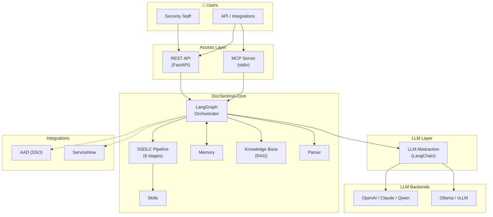
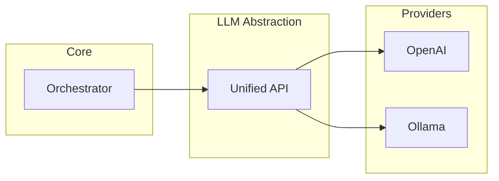
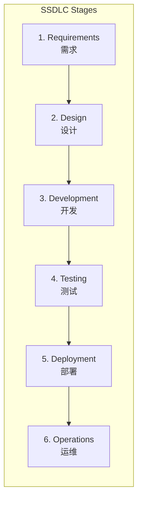
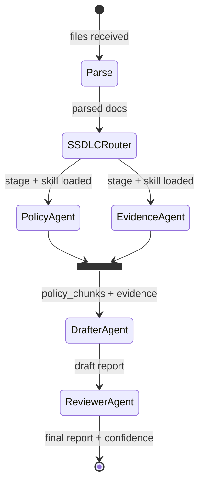
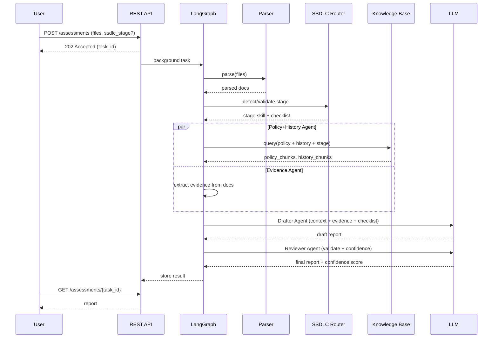
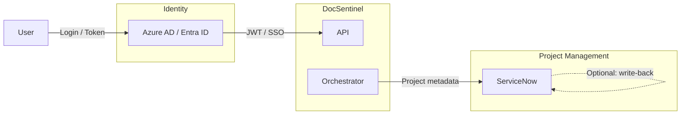
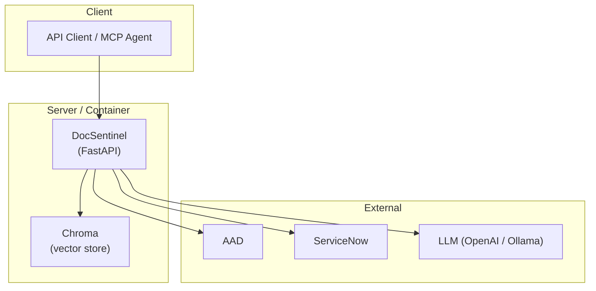

# System Architecture | 系统架构

  

**DocSentinel** — System Architecture Document (open-source style)

|                  |                                                                           |
| :--------------- | :------------------------------------------------------------------------ |
| **Version**      | 4.0                                                                       |
| **Author**       | PAN CHAO                                                                  |
| **Last updated** | 2026-03                                                                   |
| **Related**      | [Product Requirements (PRD)](./SPEC.md) · [Design docs](./docs/README.md) |

---

## Overview | 概述

DocSentinel is an AI-powered system that automates security assessment of documents, questionnaires, and reports **across the entire Secure Software Development Lifecycle (SSDLC)**. The system is orchestrated by **LangChain + LangGraph**, providing stateful, graph-based agent workflows with stage-aware routing. This document describes the **system architecture**: high-level design, components, data flow, integrations, and deployment. For product goals and requirements, see [SPEC.md](./SPEC.md).

---

## Goals & Context | 目标与背景

-   **Goal**: Reduce manual effort for security teams by automating first-pass assessment of security-related documents (questionnaires, design docs, compliance evidence) and producing structured reports (risks, compliance gaps, remediations) — covering all 6 SSDLC stages.
-   **Context**: Enterprise security teams must align with policies, standards, and frameworks (e.g. NIST, OWASP, SOC2) while reviewing many projects per year; the system provides a unified knowledge base (RAG), multi-format parsing, pluggable LLMs (cloud or local), and **SSDLC-aware assessment pipelines** powered by LangGraph.

---

## High-Level Architecture | 高层架构

The system is organized in layers: **Access** → **Core (LangGraph Orchestrator, SSDLC Pipeline, Memory, Skills, Knowledge Base, Parser)** → **LLM abstraction** → **LLM backends**. External integrations (AAD, ServiceNow) connect at the access and orchestration boundaries.

*Figure 1: Architecture overview (see repo `docs/images/architecture-overview.png`)*

### Mermaid: Logical view

---

## Component Design | 组件设计

### 1. Access Layer | 接入层

-   **REST API** (FastAPI): Request validation, routing to assessment / KB / health / skills endpoints.
-   **MCP Server** (Model Context Protocol): Standard stdio interface for autonomous agents (Claude Desktop, Cursor, OpenClaw) to discover and call tools (`assess_document`, `query_knowledge_base`).
-   **Note**: v3.0 removed the Streamlit frontend; DocSentinel is now a **headless API + MCP service**. Authentication (AAD/JWT) and rate limiting are defined but not yet wired into endpoints.

### 2. Orchestrator (LangGraph) | 任务编排

-   Built on **LangChain + LangGraph**: stateful, graph-based agent workflow with conditional edges.
-   Accepts assessment tasks (files + optional SSDLC stage / skill ID).
-   **Graph nodes**: Parser → SSDLC Router → Policy+History Agent ∥ Evidence Agent → Drafter Agent → Reviewer Agent.
-   Policy and Evidence nodes run **in parallel** (LangGraph fan-out/fan-in).
-   SSDLC Router node determines the lifecycle stage and injects stage-specific skill + checklist.
-   Assessment submission is **non-blocking** — returns task_id immediately, processes in background.
-   Singleton `KnowledgeBaseService` and cached LLM client shared across requests.

### 3. Memory | 记忆体

-   **Working memory**: Task state stored in-memory (`_tasks` dict). Not persisted across restarts.
-   **History reuse**: Past assessment reports are indexed into a dedicated Chroma collection and retrieved as context for new assessments.
-   **Status**: Redis / DB persistence is planned but not yet implemented. SQLModel models (`User`, `AuditLog`) are defined but not connected.

### 4. Skills & Personas | 技能与角色

-   **Persona-based Assessment**: Defines "who" is assessing (e.g. ISO 27001 Auditor vs. AppSec Engineer).
-   **Built-in Persona Skills**: 4 hardcoded personas (ISO 27001 Auditor, AppSec Engineer, GDPR DPO, Cloud Architect) in `skills_registry.py`.
-   **Built-in SSDLC Skills**: 6 stage-specific skills (one per SSDLC stage) with tailored `system_prompt`, `risk_focus`, checklists, and `compliance_frameworks`.
-   **Custom Skills**: File-backed (`data/skills.json`) CRUD via REST API.
-   **Dynamic Orchestration**: LangGraph injects skill-specific context into RAG queries and LLM prompts based on the selected persona and SSDLC stage.

### 5. Knowledge Base (RAG) | 知识库

-   **Vector Store**: ChromaDB for chunk-level similarity search (sentence-transformers embeddings).
-   **Graph RAG**: LightRAG for entity-relationship aware retrieval (controls → policies → vulnerabilities). Enabled via `ENABLE_GRAPH_RAG` config.
-   **Hybrid Query**: When Graph RAG is enabled, results from both vector and graph retrieval are merged and deduplicated.
-   **History Reuse**: Indexes past assessment responses into a dedicated Chroma collection.
-   **Singleton**: Single `KnowledgeBaseService` instance shared across the application lifecycle.

### 6. Parser | 文件解析

-   **Primary engine**: Docling — preserves tables, headings, and supports OCR for scanned PDFs. Outputs structured Markdown.
-   **Fallback engine**: Legacy parsers (PyMuPDF, python-docx, openpyxl, python-pptx) for when Docling is unavailable.
-   **Engine selection**: Configurable via `PARSER_ENGINE` (`auto` / `docling` / `legacy`). `auto` tries Docling first, falls back to legacy.
-   Shared pipeline for both assessment input and KB document ingestion.

### 7. LLM Abstraction (LangChain) | LLM 抽象层

-   Single interface for chat/completion via **LangChain** (`ChatOpenAI` / `ChatOllama`).
-   LangChain is also the foundation for LangGraph agent nodes — each node uses LangChain's `Runnable` interface.
-   **Cached client**: LLM instance is `@lru_cache`d — one client per process lifetime.
-   **Confidence**: Reviewer agent outputs a confidence score (0.0–1.0) as part of its JSON response; no separate LLM call needed.
-   Supported providers: OpenAI (and compatible APIs), **Ollama** (local).

---

## SSDLC Pipeline | SSDLC 流水线

DocSentinel supports all 6 SSDLC stages defined by NIST, OWASP, and Microsoft SDL. Each stage has a dedicated skill with stage-specific prompts, checklists, and risk focus areas.

| Stage | Key Assessment Focus | Example Inputs |
| :---- | :------------------- | :------------- |
| **Requirements** | Security requirements completeness, compliance mapping (GDPR, ISO 27001), risk analysis | Requirements docs, compliance checklists |
| **Design** | Security architecture, STRIDE/DREAD threat model, encryption/permission design, SDR | Architecture docs, threat models, data flow diagrams |
| **Development** | Secure coding standards, built-in controls (anti-injection, XSS), code review findings | Code review reports, coding guidelines |
| **Testing** | SAST/DAST triage, penetration test evaluation, vulnerability fix verification | Scan reports, pen-test findings |
| **Deployment** | Release readiness, config security, key management, least privilege, hardening | Deployment configs, release checklists |
| **Operations** | Vulnerability monitoring, incident response, patch management, log audit | Incident reports, audit logs, monitoring alerts |

### LangGraph Agent Flow

The **SSDLC Router** is a LangGraph node that:
1. Accepts an explicit `ssdlc_stage` parameter, or auto-detects the stage from document content.
2. Loads the corresponding stage skill (system prompt, risk focus, checklist).
3. Routes to the parallel Policy+Evidence fan-out, then sequentially to Drafter and Reviewer.

---

## Data Flow | 数据流

End-to-end flow for an assessment:

1.  User submits files (and optional `ssdlc_stage` / skill ID). API returns `task_id` immediately (non-blocking).
2.  **Parser** converts files to unified Markdown/text format (Docling or legacy).
3.  **SSDLC Router** determines the lifecycle stage and loads stage-specific skill + checklist.
4.  **Policy+History Agent** queries KB (vector + graph RAG) and **Evidence Agent** scans documents — these run **in parallel** via LangGraph fan-out.
5.  **Drafter Agent** synthesizes findings into a structured report via LLM, guided by the stage checklist.
6.  **Reviewer Agent** validates and scores the report (confidence 0.0–1.0).
7.  User polls `GET /assessments/{task_id}` to retrieve the completed report.

---

## Integration Points | 集成

-   **AAD**: SSO and API token validation (OAuth2/OIDC).
-   **ServiceNow**: Read project metadata (type, compliance scope, owner); optional write-back of assessment results to tickets.

See [docs/04-integration-guide.md](./docs/04-integration-guide.md) for configuration and field mapping.

---

## Security Architecture | 安全架构

Security is designed along five areas (detailed in [PRD §7.2](./SPEC.md)):

| Area                  | Summary                                                                                                           |
| :-------------------- | :---------------------------------------------------------------------------------------------------------------- |
| **Identity & access** | AAD/SSO, RBAC (analyst, lead, project owner, API consumer, admin), token/API key, data isolation by project/role. |
| **Data**              | TLS for transport; secrets not in code; minimal retention; optional local-only LLM for data sovereignty.          |
| **Application**       | Input validation, injection prevention, dependency/SCA, safe error responses, security headers, rate limiting.    |
| **Operations**        | Audit log (who/what/when), operational logging without sensitive content, alerting, backup and recovery.          |
| **Supply chain**      | Trusted dependencies, vulnerability handling, license compliance.                                                 |

---

## Deployment View | 部署视图

-   **Runtime**: Python 3.10+, FastAPI, Uvicorn.
-   **Storage**: Vector store (Chroma) persisted on disk or network volume; optional Redis for memory/session.
-   **Network**: Outbound to AAD, ServiceNow, and LLM endpoints; TLS recommended for production.
-   **Deployment**: Single node / container for MVP; scale out by separating API and worker if needed.

See [docs/05-deployment-runbook.md](./docs/05-deployment-runbook.md) for environment, configuration, and runbook.

---

## References | 参考

| Document                                                                                             | Description                                                     |
| :--------------------------------------------------------------------------------------------------- | :-------------------------------------------------------------- |
| [SPEC.md](./SPEC.md)                                                                                 | Product requirements, pain points, features, security controls. |
| [docs/01-architecture-and-tech-stack.md](./docs/01-architecture-and-tech-stack.md)                   | Technology choices and module layout.                           |
| [docs/02-api-specification.yaml](./docs/02-api-specification.yaml)                                   | OpenAPI spec.                                                   |
| [docs/03-assessment-report-and-skill-contract.md](./docs/03-assessment-report-and-skill-contract.md) | Report schema and Skill I/O.                                    |
| [docs/04-integration-guide.md](./docs/04-integration-guide.md)                                       | AAD, ServiceNow integration.                                    |
| [docs/05-deployment-runbook.md](./docs/05-deployment-runbook.md)                                     | Deployment and operations.                                      |

---

*This architecture document is part of the [DocSentinel](https://github.com/arthurpanhku/DocSentinel) open-source project.*
