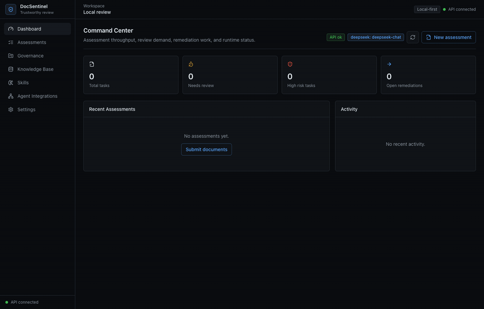
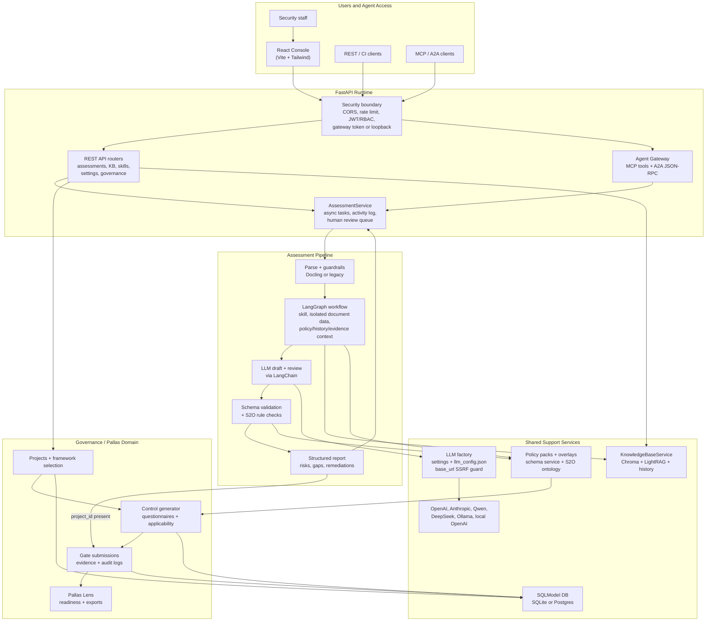
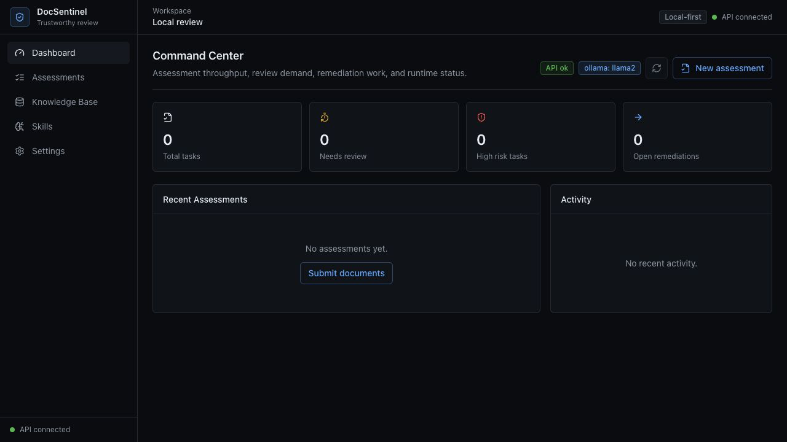

<div align="center">

[English](README.md) | [简体中文](README_zh.md) | [日本語](README_ja.md) | [한국어](README_ko.md) | [Français](README_fr.md) | [Deutsch](README_de.md) | [Русский](README_ru.md)

</div>

<p align="center">
  
  <br/>
  <sub>Security review mascot logo for the DocSentinel console and documentation.</sub>
</p>

<p align="center">
  <strong>DocSentinel</strong><br/>
  <em>AI-powered SSDLC platform — Secure your software from requirements to operations</em>
</p>

<p align="center">
  <a href="https://github.com/arthurpanhku/DocSentinel/releases"></a>
  <a href="https://github.com/arthurpanhku/DocSentinel/blob/main/LICENSE"></a>
  <a href="https://www.python.org/downloads/"></a>
  <a href="https://github.com/arthurpanhku/DocSentinel"></a>
  <a href="docs/06-agent-integration.md"></a>
  <a href="docs/06-agent-integration.md"></a>
  <a href="SECURITY.md"></a>
  <a href="https://python.langchain.com/"></a>
  <a href="https://langchain-ai.github.io/langgraph/"></a>
</p>

<p align="center">
  <a href="https://glama.ai/mcp/servers/arthurpanhku/DocSentinel">
    
  </a>
</p>

---

## What is DocSentinel?

**DocSentinel** is an AI-powered **SSDLC (Secure Software Development Lifecycle) platform** for security teams. It automates security activities across all six phases of the software development lifecycle using intelligent AI agents orchestrated by **LangGraph** and powered by **LangChain**. It automates the review of security-related **documents, forms, and reports** — from requirements and design through development, testing, deployment, and operations — comparing inputs against your policy and knowledge base to produce **structured assessment reports** with risks, compliance gaps, and remediation suggestions.

Instead of only reviewing documents at the pre-release stage, DocSentinel embeds security from day one:

| SSDLC Phase | What DocSentinel Does |
| :--- | :--- |
| **Requirements** | Extract security requirements, identify compliance obligations (GDPR, PCI DSS, SOC2) |
| **Design** | Automated threat modeling (STRIDE/DREAD), security architecture review, SDR reports |
| **Development** | Secure coding assessment, SAST findings triage, coding guidance |
| **Testing** | SAST/DAST report analysis, penetration test review, vulnerability prioritization |
| **Deployment** | Configuration security review, hardening assessment, release sign-off |
| **Operations** | Vulnerability monitoring, incident response assistance, log audit |

Built as a **React console + FastAPI service + MCP/A2A agent gateway**,
DocSentinel integrates into local security review workflows, CI/CD pipelines,
AI agents, and multi-agent platforms without giving external agents approval
authority.

- **LangGraph orchestration**: Stateful, graph-based agent workflows with conditional branching per SSDLC stage.
- **Multi-format input**: PDF, Word, Excel, PPT, text — parsed into a unified format for the LLM.
- **Knowledge base (RAG)**: Upload policy and compliance documents; the agent uses them as reference when assessing.
- **Multiple LLMs**: Use OpenAI, Claude, Qwen, or **Ollama** (local) via a single interface.
- **Structured output**: JSON/Markdown reports with risk items, compliance gaps, and actionable remediations.

Ideal for enterprises that need to scale security assessments across many projects and SSDLC stages without proportionally scaling headcount.

---

## Product Tour



The local React console brings the main workflow into one operational surface:

- **Command Center**: live API and LLM status, assessment throughput, review
  demand, remediation queues, and recent activity.
- **Assessment Workbench**: upload project documents, choose SSDLC phase/skill,
  inspect AI-generated risks, and complete human review.
- **Governance Portal**: create projects, apply public framework overlays,
  generate controls, submit evidence, and track Pallas Lens readiness.
- **Knowledge Base**: ingest policies and standards for RAG-backed review.
- **Agent Integrations**: expose governed MCP and A2A tools to coding agents and
  multi-agent platforms without granting approval authority.
- **Settings**: switch providers such as DeepSeek, OpenAI, Anthropic, Qwen, or
  Ollama; API keys are accepted locally and only shown as masked previews.

---

## Why DocSentinel?

| Pain Point | DocSentinel Solution |
| :--- | :--- |
| **Fragmented SSDLC coverage**<br>Most tools only address testing/deployment. | **Full lifecycle agents** cover all 6 SSDLC phases with dedicated AI personas. |
| **Fragmented criteria**<br>Policies, standards, and precedents are scattered. | Single **knowledge base** ensures consistent findings and traceability. |
| **No automated threat modeling**<br>Threat models are created ad-hoc. | **Design Agent** generates STRIDE/DREAD threat models from architecture docs. |
| **Heavy questionnaire workflow**<br>Endless review cycles. | **Automated first-pass** and gap analysis reduces manual back-and-forth rounds. |
| **SAST/DAST report overload**<br>Too many findings, too little context. | **Testing Agent** triages, prioritizes, and maps findings to threat models. |
| **Pre-release review pressure**<br>Everything lands on security at the end. | **Shift-left** approach catches issues early in requirements and design. **Structured reports** help reviewers focus on decision-making. |
| **Scale vs. consistency**<br>Manual reviews vary by reviewer. | **LangGraph workflows** and **unified pipeline** ensure consistent, auditable assessment across projects. |
| **SSDLC coverage gaps**<br>Security involvement is uneven across lifecycle stages; early stages get less scrutiny. | **Stage-aware assessment** covers all 6 SSDLC stages with dedicated skills and checklists. |

*See the full problem statement and SSDLC phase details in [SPEC.md](./SPEC.md).*

---

## Architecture

DocSentinel is a **React Console + FastAPI** application with three governed
entry paths: REST APIs for the console and CI, MCP tools for coding agents, and
A2A JSON-RPC for remote agent delegation. These entry paths converge on the
same `AssessmentService`, LangGraph assessment pipeline, knowledge base, and
human-review lifecycle. Governance workflows from PallasGuard are now a
first-class domain beside assessment, backed by SQLModel records, policy packs,
control evidence, audit trails, and Pallas Lens readiness scoring.




**Data flow (simplified):**

1.  Security staff work in the React console; REST clients call `/api/v1/*`;
    coding agents call MCP or A2A through the agent gateway.
2.  REST write paths use JWT/RBAC dependencies. Agent protocols use a bearer
    gateway token or loopback-only development access. LLM-costly POST paths are
    rate limited by IP or bearer token.
3.  Assessment submissions enter `AssessmentService`, which creates an async
    task, parses uploaded or approved local documents, applies guardrails, and
    invokes the LangGraph assessment pipeline.
4.  The LangGraph pipeline loads the selected skill, wraps untrusted document
    content as data, retrieves policy/history/evidence context from the KB, asks
    the LLM for draft/review text, and converts the result into the structured
    assessment schema.
5.  Deterministic services remain authoritative for governance decisions:
    policy-pack schemas, the S2O rule engine, control applicability, and schema
    validation cross-check LLM output before it enters the review queue.
6.  When an assessment is linked to a project, findings are persisted as Gate 3
    control evidence. Governance workflows then use the same SQLModel store for
    projects, controls, submissions, audit logs, Pallas Lens scoring, and exports.
7.  The KB persists chunks in Chroma, optional graph artifacts in LightRAG, and
    prior assessment history for reuse. Runtime LLM settings are loaded from
    `.env` plus `llm_config.json`, and every provider base URL is checked by the
    network guard before client construction.

*Detailed architecture: [ARCHITECTURE.md](./ARCHITECTURE.md) and [docs/01-architecture-and-tech-stack.md](./docs/01-architecture-and-tech-stack.md).*

---

## Core Capabilities

### SSDLC Full Lifecycle Coverage
Six dedicated AI agents, each with phase-specific skills, prompts, and knowledge base collections. Run individual phases or a full end-to-end SSDLC assessment:
- **Requirements**: Security requirements, compliance mapping, initial risk analysis.
- **Design**: Architecture review, STRIDE/DREAD threat modeling, SDR.
- **Development**: Secure coding standards, code review findings.
- **Testing**: SAST/DAST report triage, pen-test evaluation.
- **Deployment**: Release readiness, config security, hardening.
- **Operations**: Incident response, vulnerability monitoring, log audit.

### Automated Security Assessment
Submit security questionnaires, design documents, or audit reports. DocSentinel analyzes them using configured LLMs and identifies:
- **Security Risks**: Classified by severity (Critical, High, Medium, Low).
- **Compliance Gaps**: Missing controls against frameworks like ISO 27001, PCI DSS.
- **Remediation Steps**: Actionable advice to fix identified issues.

### Governance & Compliance Workflows
PallasGuard governance capabilities are merged into DocSentinel as first-class
project workflows:
- **Policy packs**: `generic-ssdlc` plus eight public overlays for NIST SSDF,
  MAS TRM, ISO 27001:2022, EU AI Act, ISO 42001, China MLPS 2.0, OWASP SAMM,
  and EU CRA.
- **Gate workflows**: Gate 1/3 questionnaire, submission, approval, audit, and
  evidence tracking flows backed by SQLModel and Alembic migrations.
- **Control generation**: Framework overlays generate applicable SCD controls
  and expected evidence without replacing DocSentinel's existing assessment
  engine.
- **Pallas Lens**: Project readiness scoring summarizes control coverage,
  evidence depth, and next actions in the React governance portal.

### Intelligent Agent Orchestration (LangGraph)
- **Stateful workflows**: LangGraph state machine maintains context across phases
- **Cross-phase traceability**: Threats from Design link to test cases in Testing and monitoring rules in Operations
- **Conditional routing**: Agents activate based on project risk level, compliance requirements, or user selection
- **Human-in-the-loop**: Interrupt points for human review at phase boundaries
- **Checkpointing**: Long-running assessments persist state and resume

### RAG-Powered Knowledge Base
Upload your organization's security policies, standards, and past audits. Phase-specific collections ensure each agent retrieves the most relevant context:
- Requirements: compliance frameworks, security policies
- Design: threat catalogs, security patterns
- Development: secure coding standards (OWASP)
- Testing: vulnerability databases, remediation guides
- Deployment: CIS benchmarks, hardening guides
- Operations: CVE databases, incident playbooks

### LangGraph Agent Orchestration
Powered by **LangChain + LangGraph** — stateful, graph-based agent workflows with conditional routing per SSDLC stage. Parallel execution of Policy and Evidence agents, followed by Drafter and Reviewer agents.

### API-First, MCP & A2A Ready
Use the local React console for human review, integrate CI/CD pipelines through the
REST API, or expose the same assessment capabilities to AI agents (Claude Desktop,
Cursor, OpenClaw) through MCP. A2A-compatible platforms can delegate assessment
tasks to DocSentinel as a specialist security agent.

---

## Agent Integration (MCP + A2A)

Use MCP to expose bounded tools to Claude Desktop, Cursor, coding agents, and
workflow platforms. Use A2A to expose DocSentinel as a remote specialist agent.
REST, MCP, and A2A submissions share the same task lifecycle and activity log.
Agent-created assessments always remain drafts until a human reviewer approves
them in the console.

| Interface | Endpoint | Purpose |
| :--- | :--- | :--- |
| **MCP stdio** | `python app/mcp_server.py` | Local desktop and coding-agent integration |
| **MCP Streamable HTTP** | `POST /mcp/` | Remote tool discovery and invocation |
| **A2A Agent Card** | `GET /.well-known/agent-card.json` | Standards-based agent discovery |
| **A2A JSON-RPC** | `POST /a2a` | Remote task delegation |
| **Integration status** | `GET /api/v1/integrations/agents/status` | Non-secret protocol and capability status |
| **Console** | `/console/integrations` | Human-readable integration state |

MCP exposes five governed tools:

- `submit_document_assessment`
- `get_assessment_status`
- `assess_document` (compatibility tool)
- `query_knowledge_base`
- `get_agent_gateway_status`

The A2A Agent Card advertises assessment submission, assessment retrieval, and
security knowledge query skills.

### What can it do?
Once connected, you can ask your AI agent:
> "Analyze the attached `requirements.pdf` for missing security requirements using DocSentinel."
>
> "Run a STRIDE threat model on `system-design.pdf` using the Design Agent."
>
> "Triage these SonarQube SAST findings and prioritize by risk."

### Configuration Guide

#### 1. Claude Desktop
Add to your `claude_desktop_config.json`:
```json
{
  "mcpServers": {
    "docsentinel": {
      "command": "/path/to/DocSentinel/.venv/bin/python",
      "args": ["/path/to/DocSentinel/app/mcp_server.py"],
      "env": {
        "OPENAI_API_KEY": "sk-...",
        "CHROMA_PERSIST_DIR": "/absolute/path/to/data/chroma",
        "MCP_DOCUMENT_ROOTS": "/absolute/path/to/approved/documents"
      }
    }
  }
}
```

`assess_document` only reads files inside `MCP_DOCUMENT_ROOTS`. Use `:` to
separate multiple roots on macOS/Linux, or `;` on Windows. If unset, the
server only allows `./examples`.

FastAPI also serves Streamable HTTP MCP at `/mcp/` and publishes the A2A Agent
Card at `/.well-known/agent-card.json`. Tokenless protocol access is
loopback-only. External agents cannot approve, reject, or bypass human review.

For network, Docker, or reverse-proxy access, configure:

```dotenv
AGENT_GATEWAY_TOKEN=generate-a-long-random-value
AGENT_GATEWAY_PUBLIC_URL=https://docsentinel.internal.example
AGENT_GATEWAY_ALLOWED_HOSTS=docsentinel.internal.example
AGENT_GATEWAY_ALLOWED_ORIGINS=https://trusted-agent-console.internal.example
```

Clients send `Authorization: Bearer <AGENT_GATEWAY_TOKEN>`. Keep
`MCP_DOCUMENT_ROOTS`, allowed hosts, and allowed origins as narrow as possible.
Docker bridge traffic is not treated as loopback, so published MCP/A2A ports
require a token.

#### 2. Cursor
1. Go to **Settings > Features > MCP**.
2. Click **+ Add New MCP Server**.
   - **Name**: `docsentinel`
   - **Type**: `stdio`
   - **Command**: `/path/to/DocSentinel/.venv/bin/python`
   - **Args**: `/path/to/DocSentinel/app/mcp_server.py`

*See full guide in [docs/06-agent-integration.md](docs/06-agent-integration.md).*

---

## Quick Start

### Option A: One-Click Deployment (Recommended)

```bash
git clone https://github.com/arthurpanhku/DocSentinel.git
cd DocSentinel
chmod +x deploy.sh
./deploy.sh
```

-   **React Console**: [http://localhost:8000/console](http://localhost:8000/console)
-   **Agent Integrations**: [http://localhost:8000/console/integrations](http://localhost:8000/console/integrations)
-   **API Docs**: [http://localhost:8000/api-docs](http://localhost:8000/api-docs)
-   **A2A Agent Card**: [http://localhost:8000/.well-known/agent-card.json](http://localhost:8000/.well-known/agent-card.json)

To connect an external agent through the published Docker port, set
`AGENT_GATEWAY_TOKEN` in `.env` before running `./deploy.sh`.

### Option B: Manual Setup

**Prerequisites**: **Python 3.11+** and **Node.js 20+**. Optional:
[Ollama](https://ollama.ai) (`ollama pull llama2`).

```bash
git clone https://github.com/arthurpanhku/DocSentinel.git
cd DocSentinel
python3 -m venv .venv
source .venv/bin/activate   # Windows: .venv\Scripts\activate
pip install -r requirements.txt
cp .env.example .env        # Edit if needed: LLM_PROVIDER=ollama or openai
npm install --prefix frontend
npm run build --prefix frontend
uvicorn app.main:app --reload --host 0.0.0.0 --port 8000
```

#### DeepSeek example

Set these values in `.env`, or use the **Settings** page after the server is
running. Never commit real API keys.

```dotenv
LLM_PROVIDER=deepseek
DEEPSEEK_BASE_URL=https://api.deepseek.com
DEEPSEEK_MODEL=deepseek-chat
DEEPSEEK_API_KEY=sk-your-deepseek-key
```

-   **API docs**: [http://localhost:8000/api-docs](http://localhost:8000/api-docs) · **Health**: [http://localhost:8000/health](http://localhost:8000/health)
-   **React Console**: [http://localhost:8000/console](http://localhost:8000/console)
-   **Agent Integrations**: [http://localhost:8000/console/integrations](http://localhost:8000/console/integrations)
-   **MCP Streamable HTTP**: `http://localhost:8000/mcp/`
-   **A2A Agent Card**: [http://localhost:8000/.well-known/agent-card.json](http://localhost:8000/.well-known/agent-card.json)
-   **Legacy Review Console (HITL)**: [http://localhost:8000/docs/review-console.html](http://localhost:8000/docs/review-console.html)

### React Console

DocSentinel includes a React + TypeScript + Vite + Tailwind CSS console for assessments, knowledge base operations, skills, and system status.



```bash
npm install --prefix frontend
npm run build --prefix frontend
uvicorn app.main:app --reload --host 0.0.0.0 --port 8000
```

Open [http://localhost:8000/console](http://localhost:8000/console). For frontend-only development, run:

```bash
npm run dev --prefix frontend
```

The Vite dev server proxies `/api`, `/health`, and `/config` to `http://localhost:8000`.

The **Settings** page can update the running server's LLM provider, model, base URL, and API key. API keys are only returned to the UI as masked previews. For persistent startup defaults, set the matching values in `.env`.

---

### Example: Submit an SSDLC assessment

```bash
# Run a Design phase assessment (threat modeling)
curl -X POST "http://localhost:8000/api/v1/assessments" \
  -F "files=@examples/architecture-doc.pdf" \
  -F "phase=design" \
  -F "scenario_id=threat-modeling"

# Response: { "task_id": "...", "status": "accepted" }
# Get the result
curl "http://localhost:8000/api/v1/assessments/TASK_ID"
```

### Example: Upload to KB and query

```bash
# Upload a security policy to the requirements KB collection
curl -X POST "http://localhost:8000/api/v1/kb/documents" \
  -F "file=@examples/sample-policy.txt" \
  -F "collection=kb_requirements"

# Query the KB (RAG)
curl -X POST "http://localhost:8000/api/v1/kb/query" \
  -H "Content-Type: application/json" \
  -d '{"query": "What are the access control requirements?", "top_k": 5}'
```

---

## Hosted deployment

A hosted deployment is available on [Fronteir AI](https://fronteir.ai/mcp/arthurpanhku-docsentinel).

## Project Layout

```text
DocSentinel/
├── frontend/             # React + TypeScript + Vite + Tailwind console
├── app/                  # Application code
│   ├── api/              # REST routes: assessments, KB, health, skills
│   ├── agent_gateway/    # MCP/A2A adapters, auth boundary, Agent Card
│   ├── agent/            # LangGraph orchestrator, phase agents, skills
│   │   ├── orchestrator.py    # LangGraph state machine & phase routing
│   │   ├── agents/            # Phase-specific agent implementations
│   │   ├── ssdlc/             # SSDLC pipeline: stage router, stage skills, checklists
│   │   ├── skills_registry.py # Built-in skills per SSDLC phase
│   │   └── skills_service.py  # Skill CRUD and management
│   ├── core/             # Config, guardrails, security, DB
│   ├── kb/               # Knowledge Base (Chroma + LightRAG graph RAG)
│   ├── llm/              # LangChain LLM abstraction (OpenAI, Ollama)
│   ├── parser/           # Document parsing (Docling + SAST/DAST + legacy)
│   ├── models/           # Pydantic / SQLModel models
│   ├── services/         # Shared assessment task lifecycle
│   ├── main.py           # FastAPI app entry point
│   └── mcp_server.py     # MCP stdio + Streamable HTTP tools
├── tests/                # Automated tests (pytest)
├── examples/             # Sample files (questionnaires, policies, reports)
├── docs/                 # Design & Spec documentation
│   ├── 01-architecture-and-tech-stack.md
│   ├── 02-api-specification.yaml
│   ├── 03-assessment-report-and-skill-contract.md
│   ├── 04-integration-guide.md
│   ├── 05-deployment-runbook.md
│   ├── 06-agent-integration.md
│   └── schemas/
├── .github/              # Issue/PR templates, CI (Actions)
├── Dockerfile
├── docker-compose.yml
├── docker-compose.ollama.yml
├── CONTRIBUTING.md
├── CODE_OF_CONDUCT.md
├── CHANGELOG.md
├── SPEC.md               # PRD with SSDLC phase definitions
├── ARCHITECTURE.md        # System architecture with LangGraph design
├── LICENSE
├── SECURITY.md
├── requirements.txt
├── requirements-dev.txt
└── .env.example
```

---

## Configuration

| Variable | Description | Default |
| :--- | :--- | :--- |
| `LLM_PROVIDER` | `ollama` or `openai` | `ollama` |
| `OLLAMA_BASE_URL` / `OLLAMA_MODEL` | Local LLM | `http://localhost:11434` / `llama2` |
| `OPENAI_API_KEY` / `OPENAI_MODEL` | OpenAI | -- |
| `ANTHROPIC_API_KEY` / `ANTHROPIC_MODEL` | Anthropic Claude | -- / `claude-3-5-sonnet-latest` |
| `QWEN_API_KEY` / `QWEN_MODEL` | Qwen DashScope OpenAI-compatible API | -- / `qwen-plus` |
| `DEEPSEEK_API_KEY` / `DEEPSEEK_MODEL` | DeepSeek OpenAI-compatible API | -- / `deepseek-chat` |
| `COMPAT_API_KEY` / `COMPAT_BASE_URL` / `COMPAT_MODEL` | Any OpenAI-compatible hosted API | -- |
| `LOCAL_API_KEY` / `LOCAL_BASE_URL` / `LOCAL_MODEL` | Local OpenAI-compatible API | -- / `http://localhost:1234/v1` / `local-model` |
| `CHROMA_PERSIST_DIR` | Vector DB path | `./data/chroma` |
| `PARSER_ENGINE` | Parser: `auto`, `docling`, or `legacy` | `auto` |
| `ENABLE_GRAPH_RAG` | Enable LightRAG graph retrieval | `true` |
| `LANGGRAPH_CHECKPOINT_DIR` | LangGraph checkpoint persistence | `./data/checkpoints` |
| `SSDLC_DEFAULT_PHASES` | Default phases for full assessment | `requirements,design,development,testing,deployment,operations` |
| `SSDLC_DEFAULT_STAGE` | Default SSDLC stage if not specified | `auto` |
| `UPLOAD_MAX_FILE_SIZE_MB` / `UPLOAD_MAX_FILES` | Upload limits | `50` / `10` |
| `MCP_DOCUMENT_ROOTS` | Filesystem roots available to document assessment tools | `./examples` |
| `AGENT_GATEWAY_ENABLED` | Enable MCP HTTP and A2A endpoints | `true` |
| `AGENT_GATEWAY_TOKEN` | Bearer token for remote agent access; empty is loopback-only | -- |
| `AGENT_GATEWAY_PUBLIC_URL` | Public URL advertised by the A2A Agent Card | `http://localhost:8000` |
| `AGENT_GATEWAY_ALLOWED_HOSTS` | MCP DNS-rebinding Host allow-list | local hosts |
| `AGENT_GATEWAY_ALLOWED_ORIGINS` | MCP browser Origin allow-list | local origins |

*See [.env.example](./.env.example) and [docs/05-deployment-runbook.md](./docs/05-deployment-runbook.md) for full options.*

---

## Tech Stack

| Layer | Technology | Purpose |
| :--- | :--- | :--- |
| **Frontend** | React, TypeScript, Vite, Tailwind CSS | Local-first assessment and review console |
| **Agent Orchestration** | LangGraph | Stateful graph-based SSDLC workflow engine |
| **LLM Framework** | LangChain | Unified LLM abstraction, prompts, tools, RAG |
| **Web/API** | FastAPI | Async REST API with auto OpenAPI |
| **Agent Protocols** | MCP + A2A 1.0 | Governed tools and cross-agent task delegation |
| **Vector Store** | ChromaDB + LightRAG | Hybrid vector + graph RAG |
| **Parsing** | Docling + legacy fallback | Multi-format document parsing |
| **LLM Providers** | OpenAI, Anthropic, Qwen, DeepSeek, Ollama, OpenAI-compatible APIs | Cloud and local LLM support |
| **Language** | Python 3.11+ | Primary development language |

---

## Documentation and PRD

-   **[ARCHITECTURE.md](./ARCHITECTURE.md)** — System architecture: LangGraph design, SSDLC agents, data flow, deployment.
-   **[SPEC.md](./SPEC.md)** — Product requirements: SSDLC phases, features, security controls.
-   **[CHANGELOG.md](./CHANGELOG.md)** — Version history; [Releases](https://github.com/arthurpanhku/DocSentinel/releases).
-   **Design docs** [docs/](./docs/): Architecture, API spec (OpenAPI), contracts, integration guides, deployment runbook.

---

## Development & Testing

### Option A: One-Click Test (Recommended)
```bash
chmod +x test_integration.sh
./test_integration.sh
```

### Option B: Manual
```bash
pip install -r requirements-dev.txt
pytest
pytest tests/test_skills_api.py   # Run specific test
```

## Contributing

Issues and Pull Requests are welcome. Please read [CONTRIBUTING.md](CONTRIBUTING.md) for setup, tests, and commit guidelines. By participating you agree to the [CODE_OF_CONDUCT.md](CODE_OF_CONDUCT.md).

AI-Assisted Contribution: We encourage using AI tools to contribute! Check out [CONTRIBUTING_WITH_AI.md](CONTRIBUTING_WITH_AI.md) for best practices.

Submit a Skill Template: Have a great security persona for an SSDLC phase? Submit a [Skill Template](https://github.com/arthurpanhku/DocSentinel/issues/new?template=new_skill_template.md) or add it to `examples/templates/`.

---

## Security

-   **Vulnerability reporting**: See [SECURITY.md](./SECURITY.md) for responsible disclosure.
-   **Security requirements**: Follows security controls in [SPEC §7.2](./SPEC.md).
-   **Document confinement**: MCP/A2A document paths must resolve inside `MCP_DOCUMENT_ROOTS`; symlink escapes are rejected before file reads.
-   **Agent authority**: External agents may submit and inspect drafts, but cannot approve their own assessments.
-   **Remote access**: Tokenless MCP/A2A access is loopback-only. Network deployments require a bearer token, TLS, and narrow Host/Origin allow-lists.

---

## License

This project is licensed under the **MIT License** — see the [LICENSE](./LICENSE) file for details.

---

## Star History

[](https://star-history.com/#arthurpanhku/DocSentinel&Date)

---

## Author and Links

-   **Author**: PAN CHAO (Arthur Pan)
-   **Repository**: [github.com/arthurpanhku/DocSentinel](https://github.com/arthurpanhku/DocSentinel)
-   **SPEC and design docs**: See links above.

If you use DocSentinel in your organization or contribute back, we'd love to hear from you (e.g. via GitHub Discussions or Issues).
