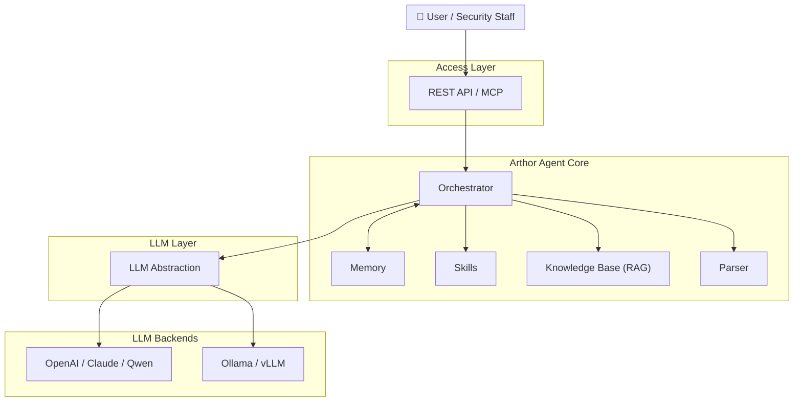

<div align="center">

[English](README.md) | [简体中文](README_zh.md) | [日本語](README_ja.md) | [한국어](README_ko.md) | [Français](README_fr.md) | [Deutsch](README_de.md)

</div>

<p align="center">
  
</p>

<p align="center">
  <strong>Arthor Agent</strong><br/>
  <em>Automated security assessment for documents and questionnaires</em>
</p>

<p align="center">
  <a href="https://github.com/arthurpanhku/Arthor-Agent/releases"></a>
  <a href="https://github.com/arthurpanhku/Arthor-Agent/blob/main/LICENSE"></a>
  <a href="https://www.python.org/downloads/"></a>
  <a href="https://github.com/arthurpanhku/Arthor-Agent"></a>
  <a href="docs/06-agent-integration.md"></a>
  <a href="docs/06-agent-integration.md"></a>
</p>

---

## What is Arthor Agent?

**Arthor Agent** is an AI-powered assistant for security teams. It automates the review of security-related **documents, forms, and reports** (e.g. Security Questionnaires, design docs, compliance evidence), compares them against your policy and knowledge base, and produces **structured assessment reports** with risks, compliance gaps, and remediation suggestions.

🚀 **Agent Ready**: Supports **Model Context Protocol (MCP)** to be used as a "skill" by OpenClaw, Claude Desktop, and other autonomous agents.

- **Multi-format input**: PDF, Word, Excel, PPT, text — parsed into a unified format for the LLM.
- **Knowledge base (RAG)**: Upload policy and compliance documents; the agent uses them as reference when assessing.
- **Multiple LLMs**: Use OpenAI, Claude, Qwen, or **Ollama** (local) via a single interface.
- **Structured output**: JSON/Markdown reports with risk items, compliance gaps, and actionable remediations.

Ideal for enterprises that need to scale security assessments across many projects without proportionally scaling headcount.

---

## Why Arthor Agent?

| Pain Point                                                                                                                    | Arthor Agent Solution                                                                        |
| :---------------------------------------------------------------------------------------------------------------------------- | :------------------------------------------------------------------------------------------- |
| **Fragmented criteria**<br>Policies, standards, and precedents are scattered.                                                 | Single **knowledge base** ensures consistent findings and traceability.                      |
| **Heavy questionnaire workflow**<br>Business fills form → Security reviews → Business adds evidence → Security reviews again. | **Automated first-pass** and gap analysis reduces manual back-and-forth rounds.              |
| **Pre-release review pressure**<br>Security needs to review and sign off on technical docs before launch.                     | **Structured reports** help reviewers focus on decision-making, not line-by-line reading.    |
| **Scale vs. consistency**<br>Many projects and standards lead to inconsistent or delayed manual reviews.                      | **Unified pipeline** with configurable scenarios keeps assessments consistent and auditable. |

*See the full problem statement and product goals in [SPEC.md](./SPEC.md).*

---

## Architecture

Arthor Agent is built around an **orchestrator** that coordinates parsing, the knowledge base (RAG), skills, and the LLM. You can use cloud or local LLMs and optional integrations (e.g. AAD, ServiceNow) as your environment requires.



**Data flow (simplified):**

1.  User uploads documents and selects scenario.
2.  **Parser** converts files (PDF, Word, Excel, PPT, etc.) to text/Markdown.
3.  **Orchestrator** loads **KB** chunks (RAG) and invokes **Skills**.
4.  **LLM** (OpenAI, Ollama, etc.) produces structured findings.
5.  Returns **assessment report** (risks, gaps, remediations).

*Detailed architecture: [ARCHITECTURE.md](./ARCHITECTURE.md) and [docs/01-architecture-and-tech-stack.md](./docs/01-architecture-and-tech-stack.md).*

---

## Features

| Area               | Capabilities                                                      |
| :----------------- | :---------------------------------------------------------------- |
| **Parsing**        | Word, PDF, Excel, PPT, Text → Markdown/JSON.                      |
| **Knowledge Base** | Multi-format upload, chunking, vectorization (Chroma), RAG query. |
| **Assessment**     | Submit files → structured report (risks, gaps, remediations).     |
| **LLM**            | Configurable provider: **Ollama** (local), OpenAI, etc.           |
| **API**            | REST API & **MCP Server** for Agent integration.                  |
| **Security**       | Built-in RBAC, Audit Logs, and Prompt Injection guards.           |
| **Integration**    | Supports **MCP** for OpenClaw, Claude Desktop, etc.               |

Roadmap (e.g. AAD/SSO, ServiceNow integration) in [SPEC.md](./SPEC.md).

---

## 👀 Features at a Glance

### 1. Assessment Workbench
Upload documents, select a persona (e.g. SOC2 Auditor), and get instant risk analysis.


### 2. Structured Report
Clear view of Risks, Compliance Gaps, and Remediation Steps.


### 3. Knowledge Base Management
Upload policy documents to RAG. The agent cites these as evidence.


---

## Quick Start

### Option A: One-Click Deployment (Recommended)

Run the deployment script to start the full stack (API + Dashboard + Vector DB + optional Ollama).

```bash
git clone https://github.com/arthurpanhku/Arthor-Agent.git
cd Arthor-Agent
chmod +x deploy.sh
./deploy.sh
```

-   **Dashboard**: [http://localhost:8501](http://localhost:8501)
-   **API Docs**: [http://localhost:8000/docs](http://localhost:8000/docs)

### Option B: Docker Manual

**Prerequisites**: **Python 3.10+**. Optional: [Ollama](https://ollama.ai) (`ollama pull llama2`).

```bash
git clone https://github.com/arthurpanhku/Arthor-Agent.git
cd Arthor-Agent
python3 -m venv .venv
source .venv/bin/activate   # Windows: .venv\Scripts\activate
pip install -r requirements.txt
cp .env.example .env        # Edit if needed: LLM_PROVIDER=ollama or openai
uvicorn app.main:app --reload --host 0.0.0.0 --port 8000
```

-   **API docs**: [http://localhost:8000/docs](http://localhost:8000/docs) · **Health**: [http://localhost:8000/health](http://localhost:8000/health)

---

### Example: submit an assessment

You can use the sample files in [examples/](examples/) to try the API.

```bash
# Use sample file from repo
curl -X POST "http://localhost:8000/api/v1/assessments" \
  -F "files=@examples/sample.txt" \
  -F "scenario_id=default"

# Response: { "task_id": "...", "status": "accepted" }
# Get the result (replace TASK_ID with the returned task_id)
curl "http://localhost:8000/api/v1/assessments/TASK_ID"
```

### Example: upload to KB and query

```bash
# Use sample policy from repo
curl -X POST "http://localhost:8000/api/v1/kb/documents" -F "file=@examples/sample-policy.txt"

# Query the KB (RAG)
curl -X POST "http://localhost:8000/api/v1/kb/query" \
  -H "Content-Type: application/json" \
  -d '{"query": "What are the access control requirements?", "top_k": 5}'
```

---

## Project layout

```text
Arthor-Agent/
├── app/                  # Application code
│   ├── api/              # REST routes: assessments, KB, health
│   ├── agent/            # Orchestration & Assessment pipeline
│   ├── core/             # Configuration (pydantic-settings)
│   ├── kb/               # Knowledge Base (Chroma, chunking, RAG)
│   ├── llm/              # LLM abstraction (OpenAI, Ollama)
│   ├── parser/           # Document parsing (PDF, Word, Excel, PPT, text)
│   ├── models/           # Pydantic models
│   └── main.py
├── tests/                # Automated tests (pytest)
├── examples/             # Sample files (questionnaires, policies)
├── docs/                 # Design & Spec documentation
│   ├── 01-architecture-and-tech-stack.md
│   ├── 02-api-specification.yaml
│   ├── 03-assessment-report-and-skill-contract.md
│   ├── 04-integration-guide.md
│   ├── 05-deployment-runbook.md
│   └── schemas/
├── .github/              # Issue/PR templates, CI (Actions)
├── Dockerfile
├── docker-compose.yml    # API only
├── docker-compose.ollama.yml  # API + Ollama optional
├── CONTRIBUTING.md       # Contribution guidelines
├── CODE_OF_CONDUCT.md    # Code of conduct
├── CHANGELOG.md
├── SPEC.md
├── LICENSE
├── SECURITY.md
├── requirements.txt
├── requirements-dev.txt  # Dev dependencies
├── pytest.ini
└── .env.example
```

---

## Configuration

| Variable                                       | Description          | Default                             |
| :--------------------------------------------- | :------------------- | :---------------------------------- |
| `LLM_PROVIDER`                                 | `ollama` or `openai` | `ollama`                            |
| `OLLAMA_BASE_URL` / `OLLAMA_MODEL`             | Local LLM            | `http://localhost:11434` / `llama2` |
| `OPENAI_API_KEY` / `OPENAI_MODEL`              | OpenAI               | —                                   |
| `CHROMA_PERSIST_DIR`                           | Vector DB path       | `./data/chroma`                     |
| `UPLOAD_MAX_FILE_SIZE_MB` / `UPLOAD_MAX_FILES` | Upload limits        | `50` / `10`                         |

*See [.env.example](./.env.example) and [docs/05-deployment-runbook.md](./docs/05-deployment-runbook.md) for full options.*

---

## Documentation and PRD

-   **[ARCHITECTURE.md](./ARCHITECTURE.md)** — System architecture: high-level diagram, Mermaid views, component design, data flow, security.
-   **[SPEC.md](./SPEC.md)** — Product requirements: problem statement, solution, features, security controls.
-   **[CHANGELOG.md](./CHANGELOG.md)** — Version history; [Releases](https://github.com/arthurpanhku/Arthor-Agent/releases).
-   **Design docs** [docs/](./docs/)：Architecture, API spec (OpenAPI), contracts, integration guides (AAD, ServiceNow), deployment runbook. Q1 Launch Checklist: [docs/LAUNCH-CHECKLIST.md](./docs/LAUNCH-CHECKLIST.md).

---

## Development & Testing

To verify your installation or contribute to the project, run the test suite:

### Option A: One-Click Test (Recommended)
Automatically sets up a test environment and runs all checks.

```bash
chmod +x test_integration.sh
./test_integration.sh
```

### Option B: Manual
```bash
# 1. Install dev dependencies
pip install -r requirements-dev.txt

# 2. Run all tests
pytest

# 3. Run specific test (e.g. Skills API)
pytest tests/test_skills_api.py
```

## Contributing

Issues and Pull Requests are welcome. Please read [CONTRIBUTING.md](CONTRIBUTING.md) for setup, tests, and commit guidelines. By participating you agree to the [CODE_OF_CONDUCT.md](CODE_OF_CONDUCT.md).

🤖 **AI-Assisted Contribution**: We encourage using AI tools to contribute! Check out [CONTRIBUTING_WITH_AI.md](CONTRIBUTING_WITH_AI.md) for best practices.

📜 **Submit a Skill Template**: Have a great security persona? Submit a [Skill Template](https://github.com/arthurpanhku/Arthor-Agent/issues/new?template=new_skill_template.md) or add it to `examples/templates/`. We welcome real-world (sanitized) security questionnaires to improve our templates!

---

## Security

-   **Vulnerability reporting**: See [SECURITY.md](./SECURITY.md) for responsible disclosure.
-   **Security requirements**: Follows security controls in [SPEC §7.2](./SPEC.md).

---

## License

This project is licensed under the **MIT License** — see the [LICENSE](./LICENSE) file for details.

---

## Star History

[](https://star-history.com/#arthurpanhku/Arthor-Agent&Date)

---

## Author and links

-   **Author**: PAN CHAO (Arthur Pan)
-   **Repository**: [github.com/arthurpanhku/Arthor-Agent](https://github.com/arthurpanhku/Arthor-Agent)
-   **SPEC and design docs**: See links above.

If you use Arthor Agent in your organization or contribute back, we’d love to hear from you (e.g. via GitHub Discussions or Issues).
