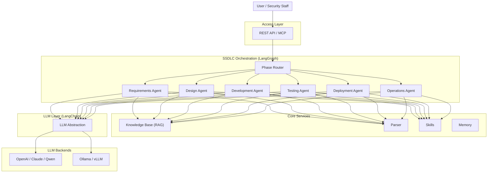

<div align="center">

[English](README.md) | [简体中文](README_zh.md) | [日本語](README_ja.md) | [한국어](README_ko.md) | [Français](README_fr.md) | [Deutsch](README_de.md)

</div>

<p align="center">
  
</p>

<p align="center">
  <strong>DocSentinel</strong><br/>
  <em>AI-powered SSDLC platform — Secure your software from requirements to operations</em>
</p>

<p align="center">
  <a href="https://github.com/arthurpanhku/DocSentinel/releases"></a>
  <a href="https://github.com/arthurpanhku/DocSentinel/blob/main/LICENSE"></a>
  <a href="https://www.python.org/downloads/"></a>
  <a href="https://github.com/arthurpanhku/DocSentinel"></a>
  <a href="docs/06-agent-integration.md"></a>
  <a href="docs/06-agent-integration.md"></a>
  <a href="https://python.langchain.com/"></a>
  <a href="https://langchain-ai.github.io/langgraph/"></a>
</p>

<p align="center">
  <a href="https://glama.ai/mcp/servers/arthurpanhku/DocSentinel">
    
  </a>
</p>

---

## What is DocSentinel?

**DocSentinel** is an AI-powered **SSDLC (Secure Software Development Lifecycle) platform** for security teams. It automates security activities across all six phases of the software development lifecycle using intelligent AI agents orchestrated by **LangGraph** and powered by **LangChain**. It automates the review of security-related **documents, forms, and reports** — from requirements and design through development, testing, deployment, and operations — comparing inputs against your policy and knowledge base to produce **structured assessment reports** with risks, compliance gaps, and remediation suggestions.

Instead of only reviewing documents at the pre-release stage, DocSentinel embeds security from day one:

| SSDLC Phase | What DocSentinel Does |
| :--- | :--- |
| **Requirements** | Extract security requirements, identify compliance obligations (GDPR, PCI DSS, SOC2) |
| **Design** | Automated threat modeling (STRIDE/DREAD), security architecture review, SDR reports |
| **Development** | Secure coding assessment, SAST findings triage, coding guidance |
| **Testing** | SAST/DAST report analysis, penetration test review, vulnerability prioritization |
| **Deployment** | Configuration security review, hardening assessment, release sign-off |
| **Operations** | Vulnerability monitoring, incident response assistance, log audit |

Built as a **headless API + MCP service**, DocSentinel integrates into your CI/CD pipelines, AI agents (Claude Desktop, Cursor, OpenClaw), and existing security workflows.

- **LangGraph orchestration**: Stateful, graph-based agent workflows with conditional branching per SSDLC stage.
- **Multi-format input**: PDF, Word, Excel, PPT, text — parsed into a unified format for the LLM.
- **Knowledge base (RAG)**: Upload policy and compliance documents; the agent uses them as reference when assessing.
- **Multiple LLMs**: Use OpenAI, Claude, Qwen, or **Ollama** (local) via a single interface.
- **Structured output**: JSON/Markdown reports with risk items, compliance gaps, and actionable remediations.

Ideal for enterprises that need to scale security assessments across many projects and SSDLC stages without proportionally scaling headcount.

---

## Why DocSentinel?

| Pain Point | DocSentinel Solution |
| :--- | :--- |
| **Fragmented SSDLC coverage**<br>Most tools only address testing/deployment. | **Full lifecycle agents** cover all 6 SSDLC phases with dedicated AI personas. |
| **Fragmented criteria**<br>Policies, standards, and precedents are scattered. | Single **knowledge base** ensures consistent findings and traceability. |
| **No automated threat modeling**<br>Threat models are created ad-hoc. | **Design Agent** generates STRIDE/DREAD threat models from architecture docs. |
| **Heavy questionnaire workflow**<br>Endless review cycles. | **Automated first-pass** and gap analysis reduces manual back-and-forth rounds. |
| **SAST/DAST report overload**<br>Too many findings, too little context. | **Testing Agent** triages, prioritizes, and maps findings to threat models. |
| **Pre-release review pressure**<br>Everything lands on security at the end. | **Shift-left** approach catches issues early in requirements and design. **Structured reports** help reviewers focus on decision-making. |
| **Scale vs. consistency**<br>Manual reviews vary by reviewer. | **LangGraph workflows** and **unified pipeline** ensure consistent, auditable assessment across projects. |
| **SSDLC coverage gaps**<br>Security involvement is uneven across lifecycle stages; early stages get less scrutiny. | **Stage-aware assessment** covers all 6 SSDLC stages with dedicated skills and checklists. |

*See the full problem statement and SSDLC phase details in [SPEC.md](./SPEC.md).*

---

## Architecture

DocSentinel is built on **LangGraph** for stateful agent orchestration and **LangChain** for unified LLM access. Six phase-specific agents are coordinated by a graph-based state machine with cross-phase context sharing. The orchestrator coordinates parsing, SSDLC stage routing, the knowledge base (RAG), skills, and the LLM. You can use cloud or local LLMs and optional integrations (e.g. AAD, ServiceNow) as your environment requires.



**Data flow (simplified):**

1.  User selects SSDLC phase(s) and uploads documents (or optionally lets the SSDLC Router auto-detect the stage).
2.  **Parser** converts files (PDF, Word, Excel, PPT, SAST/DAST reports, etc.) to text/Markdown.
3.  **LangGraph Router** dispatches to the appropriate **Phase Agent(s)**, loading stage-specific skill + checklist.
4.  Phase Agent queries **KB** (phase-specific collections) and applies **Skills**; Policy+Evidence run in parallel, then Drafter+Reviewer.
5.  **LLM** (via LangChain) produces structured findings with cross-phase traceability.
6.  Returns **assessment report** (risks, threats, gaps, remediations, confidence, SSDLC stage).

*Detailed architecture: [ARCHITECTURE.md](./ARCHITECTURE.md) and [docs/01-architecture-and-tech-stack.md](./docs/01-architecture-and-tech-stack.md).*

---

## Core Capabilities

### SSDLC Full Lifecycle Coverage
Six dedicated AI agents, each with phase-specific skills, prompts, and knowledge base collections. Run individual phases or a full end-to-end SSDLC assessment:
- **Requirements**: Security requirements, compliance mapping, initial risk analysis.
- **Design**: Architecture review, STRIDE/DREAD threat modeling, SDR.
- **Development**: Secure coding standards, code review findings.
- **Testing**: SAST/DAST report triage, pen-test evaluation.
- **Deployment**: Release readiness, config security, hardening.
- **Operations**: Incident response, vulnerability monitoring, log audit.

### Automated Security Assessment
Submit security questionnaires, design documents, or audit reports. DocSentinel analyzes them using configured LLMs and identifies:
- **Security Risks**: Classified by severity (Critical, High, Medium, Low).
- **Compliance Gaps**: Missing controls against frameworks like ISO 27001, PCI DSS.
- **Remediation Steps**: Actionable advice to fix identified issues.

### Intelligent Agent Orchestration (LangGraph)
- **Stateful workflows**: LangGraph state machine maintains context across phases
- **Cross-phase traceability**: Threats from Design link to test cases in Testing and monitoring rules in Operations
- **Conditional routing**: Agents activate based on project risk level, compliance requirements, or user selection
- **Human-in-the-loop**: Interrupt points for human review at phase boundaries
- **Checkpointing**: Long-running assessments persist state and resume

### RAG-Powered Knowledge Base
Upload your organization's security policies, standards, and past audits. Phase-specific collections ensure each agent retrieves the most relevant context:
- Requirements: compliance frameworks, security policies
- Design: threat catalogs, security patterns
- Development: secure coding standards (OWASP)
- Testing: vulnerability databases, remediation guides
- Deployment: CIS benchmarks, hardening guides
- Operations: CVE databases, incident playbooks

### LangGraph Agent Orchestration
Powered by **LangChain + LangGraph** — stateful, graph-based agent workflows with conditional routing per SSDLC stage. Parallel execution of Policy and Evidence agents, followed by Drafter and Reviewer agents.

### API-First & MCP Ready
Designed as a headless service. Integrate into CI/CD pipelines via REST API, or use as a **super-tool** within AI agents (Claude Desktop, Cursor, OpenClaw) via MCP.

---

## Agent Integration (MCP)

Connect DocSentinel to **Claude Desktop**, **Cursor**, or **OpenClaw** to use it as a powerful SSDLC security skill.

### What can it do?
Once connected, you can ask your AI agent:
> "Analyze the attached `requirements.pdf` for missing security requirements using DocSentinel."
>
> "Run a STRIDE threat model on `system-design.pdf` using the Design Agent."
>
> "Triage these SonarQube SAST findings and prioritize by risk."

### Configuration Guide

#### 1. Claude Desktop
Add to your `claude_desktop_config.json`:
```json
{
  "mcpServers": {
    "docsentinel": {
      "command": "/path/to/DocSentinel/.venv/bin/python",
      "args": ["/path/to/DocSentinel/app/mcp_server.py"],
      "env": {
        "OPENAI_API_KEY": "sk-...",
        "CHROMA_PERSIST_DIR": "/absolute/path/to/data/chroma"
      }
    }
  }
}
```

#### 2. Cursor
1. Go to **Settings > Features > MCP**.
2. Click **+ Add New MCP Server**.
   - **Name**: `docsentinel`
   - **Type**: `stdio`
   - **Command**: `/path/to/DocSentinel/.venv/bin/python`
   - **Args**: `/path/to/DocSentinel/app/mcp_server.py`

*See full guide in [docs/06-agent-integration.md](docs/06-agent-integration.md).*

---

## Quick Start

### Option A: One-Click Deployment (Recommended)

```bash
git clone https://github.com/arthurpanhku/DocSentinel.git
cd DocSentinel
chmod +x deploy.sh
./deploy.sh
```

-   **API Docs**: [http://localhost:8000/docs](http://localhost:8000/docs)

### Option B: Manual Setup

**Prerequisites**: **Python 3.10+**. Optional: [Ollama](https://ollama.ai) (`ollama pull llama2`).

```bash
git clone https://github.com/arthurpanhku/DocSentinel.git
cd DocSentinel
python3 -m venv .venv
source .venv/bin/activate   # Windows: .venv\Scripts\activate
pip install -r requirements.txt
cp .env.example .env        # Edit if needed: LLM_PROVIDER=ollama or openai
uvicorn app.main:app --reload --host 0.0.0.0 --port 8000
```

-   **API docs**: [http://localhost:8000/docs](http://localhost:8000/docs) · **Health**: [http://localhost:8000/health](http://localhost:8000/health)

---

### Example: Submit an SSDLC assessment

```bash
# Run a Design phase assessment (threat modeling)
curl -X POST "http://localhost:8000/api/v1/assessments" \
  -F "files=@examples/architecture-doc.pdf" \
  -F "phase=design" \
  -F "scenario_id=threat-modeling"

# Response: { "task_id": "...", "status": "accepted" }
# Get the result
curl "http://localhost:8000/api/v1/assessments/TASK_ID"
```

### Example: Upload to KB and query

```bash
# Upload a security policy to the requirements KB collection
curl -X POST "http://localhost:8000/api/v1/kb/documents" \
  -F "file=@examples/sample-policy.txt" \
  -F "collection=kb_requirements"

# Query the KB (RAG)
curl -X POST "http://localhost:8000/api/v1/kb/query" \
  -H "Content-Type: application/json" \
  -d '{"query": "What are the access control requirements?", "top_k": 5}'
```

---

## Hosted deployment

A hosted deployment is available on [Fronteir AI](https://fronteir.ai/mcp/arthurpanhku-docsentinel).

## Project Layout

```text
DocSentinel/
├── app/                  # Application code
│   ├── api/              # REST routes: assessments, KB, health, skills
│   ├── agent/            # LangGraph orchestrator, phase agents, skills
│   │   ├── orchestrator.py    # LangGraph state machine & phase routing
│   │   ├── agents/            # Phase-specific agent implementations
│   │   ├── ssdlc/             # SSDLC pipeline: stage router, stage skills, checklists
│   │   ├── skills_registry.py # Built-in skills per SSDLC phase
│   │   └── skills_service.py  # Skill CRUD and management
│   ├── core/             # Config, guardrails, security, DB
│   ├── kb/               # Knowledge Base (Chroma + LightRAG graph RAG)
│   ├── llm/              # LangChain LLM abstraction (OpenAI, Ollama)
│   ├── parser/           # Document parsing (Docling + SAST/DAST + legacy)
│   ├── models/           # Pydantic / SQLModel models
│   ├── main.py           # FastAPI app entry point
│   └── mcp_server.py     # MCP Server for agent integration
├── tests/                # Automated tests (pytest)
├── examples/             # Sample files (questionnaires, policies, reports)
├── docs/                 # Design & Spec documentation
│   ├── 01-architecture-and-tech-stack.md
│   ├── 02-api-specification.yaml
│   ├── 03-assessment-report-and-skill-contract.md
│   ├── 04-integration-guide.md
│   ├── 05-deployment-runbook.md
│   ├── 06-agent-integration.md
│   └── schemas/
├── .github/              # Issue/PR templates, CI (Actions)
├── Dockerfile
├── docker-compose.yml
├── docker-compose.ollama.yml
├── CONTRIBUTING.md
├── CODE_OF_CONDUCT.md
├── CHANGELOG.md
├── SPEC.md               # PRD with SSDLC phase definitions
├── ARCHITECTURE.md        # System architecture with LangGraph design
├── LICENSE
├── SECURITY.md
├── requirements.txt
├── requirements-dev.txt
└── .env.example
```

---

## Configuration

| Variable | Description | Default |
| :--- | :--- | :--- |
| `LLM_PROVIDER` | `ollama` or `openai` | `ollama` |
| `OLLAMA_BASE_URL` / `OLLAMA_MODEL` | Local LLM | `http://localhost:11434` / `llama2` |
| `OPENAI_API_KEY` / `OPENAI_MODEL` | OpenAI | -- |
| `CHROMA_PERSIST_DIR` | Vector DB path | `./data/chroma` |
| `PARSER_ENGINE` | Parser: `auto`, `docling`, or `legacy` | `auto` |
| `ENABLE_GRAPH_RAG` | Enable LightRAG graph retrieval | `true` |
| `LANGGRAPH_CHECKPOINT_DIR` | LangGraph checkpoint persistence | `./data/checkpoints` |
| `SSDLC_DEFAULT_PHASES` | Default phases for full assessment | `requirements,design,development,testing,deployment,operations` |
| `SSDLC_DEFAULT_STAGE` | Default SSDLC stage if not specified | `auto` |
| `UPLOAD_MAX_FILE_SIZE_MB` / `UPLOAD_MAX_FILES` | Upload limits | `50` / `10` |

*See [.env.example](./.env.example) and [docs/05-deployment-runbook.md](./docs/05-deployment-runbook.md) for full options.*

---

## Tech Stack

| Layer | Technology | Purpose |
| :--- | :--- | :--- |
| **Agent Orchestration** | LangGraph | Stateful graph-based SSDLC workflow engine |
| **LLM Framework** | LangChain | Unified LLM abstraction, prompts, tools, RAG |
| **Web/API** | FastAPI | Async REST API with auto OpenAPI |
| **Vector Store** | ChromaDB + LightRAG | Hybrid vector + graph RAG |
| **Parsing** | Docling + legacy fallback | Multi-format document parsing |
| **LLM Providers** | OpenAI, Ollama | Cloud and local LLM support |
| **Language** | Python 3.10+ | Primary development language |

---

## Documentation and PRD

-   **[ARCHITECTURE.md](./ARCHITECTURE.md)** — System architecture: LangGraph design, SSDLC agents, data flow, deployment.
-   **[SPEC.md](./SPEC.md)** — Product requirements: SSDLC phases, features, security controls.
-   **[CHANGELOG.md](./CHANGELOG.md)** — Version history; [Releases](https://github.com/arthurpanhku/DocSentinel/releases).
-   **Design docs** [docs/](./docs/): Architecture, API spec (OpenAPI), contracts, integration guides, deployment runbook.

---

## Development & Testing

### Option A: One-Click Test (Recommended)
```bash
chmod +x test_integration.sh
./test_integration.sh
```

### Option B: Manual
```bash
pip install -r requirements-dev.txt
pytest
pytest tests/test_skills_api.py   # Run specific test
```

## Contributing

Issues and Pull Requests are welcome. Please read [CONTRIBUTING.md](CONTRIBUTING.md) for setup, tests, and commit guidelines. By participating you agree to the [CODE_OF_CONDUCT.md](CODE_OF_CONDUCT.md).

AI-Assisted Contribution: We encourage using AI tools to contribute! Check out [CONTRIBUTING_WITH_AI.md](CONTRIBUTING_WITH_AI.md) for best practices.

Submit a Skill Template: Have a great security persona for an SSDLC phase? Submit a [Skill Template](https://github.com/arthurpanhku/DocSentinel/issues/new?template=new_skill_template.md) or add it to `examples/templates/`.

---

## Security

-   **Vulnerability reporting**: See [SECURITY.md](./SECURITY.md) for responsible disclosure.
-   **Security requirements**: Follows security controls in [SPEC §7.2](./SPEC.md).

---

## License

This project is licensed under the **MIT License** — see the [LICENSE](./LICENSE) file for details.

---

## Star History

[](https://star-history.com/#arthurpanhku/DocSentinel&Date)

---

## Author and Links

-   **Author**: PAN CHAO (Arthur Pan)
-   **Repository**: [github.com/arthurpanhku/DocSentinel](https://github.com/arthurpanhku/DocSentinel)
-   **SPEC and design docs**: See links above.

If you use DocSentinel in your organization or contribute back, we'd love to hear from you (e.g. via GitHub Discussions or Issues).
