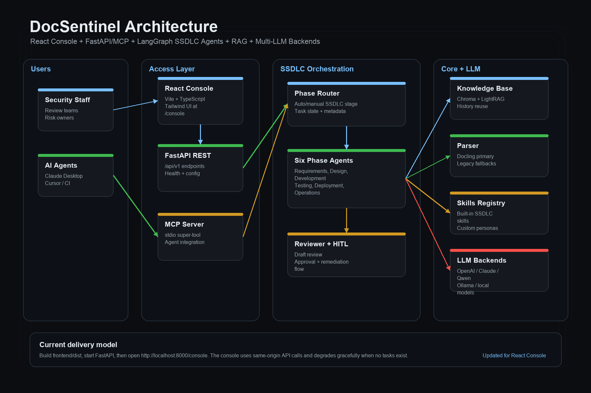
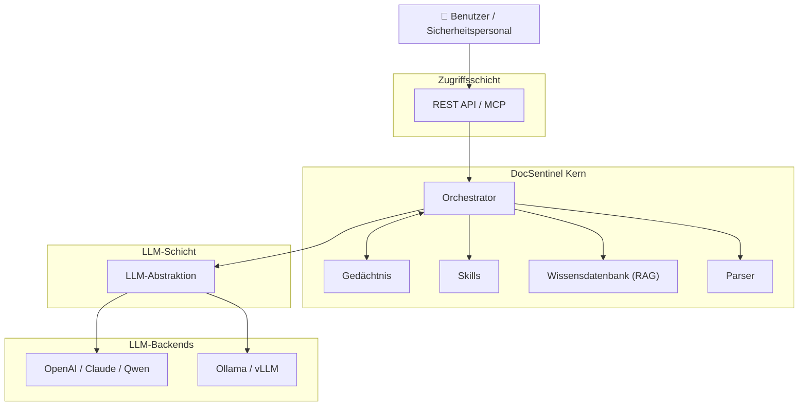

<div align="center">

[English](README.md) | [简体中文](README_zh.md) | [日本語](README_ja.md) | [한국어](README_ko.md) | [Français](README_fr.md) | [Deutsch](README_de.md)

</div>

<p align="center">
  
</p>

<p align="center">
  <strong>DocSentinel</strong><br/>
  <em>Automatisierte Sicherheitsbewertung für Dokumente und Fragebögen</em>
</p>

<p align="center">
  <a href="https://github.com/arthurpanhku/DocSentinel/releases"></a>
  <a href="https://github.com/arthurpanhku/DocSentinel/blob/main/LICENSE"></a>
  <a href="https://www.python.org/downloads/"></a>
  <a href="https://github.com/arthurpanhku/DocSentinel"></a>
  <a href="docs/06-agent-integration.md"></a>
  <a href="docs/06-agent-integration.md"></a>
</p>

<p align="center">
  <a href="https://glama.ai/mcp/servers/arthurpanhku/docsentinel">
    
  </a>
</p>

---

## Was ist DocSentinel?

**DocSentinel** ist ein KI-gestützter Assistent für Sicherheitsteams. Er automatisiert die Überprüfung von sicherheitsrelevanten **Dokumenten, Formularen und Berichten** (z. B. Sicherheitsfragebögen, Designdokumente, Compliance-Nachweise), vergleicht sie mit Ihren Richtlinien und Ihrer Wissensdatenbank und erstellt **strukturierte Bewertungsberichte** mit Risikopositionen, Compliance-Lücken und Vorschlägen zur Behebung.

🚀 **Agent Ready**: Unterstützt das **Model Context Protocol (MCP)**, um als "Skill" von OpenClaw, Claude Desktop und anderen autonomen Agenten direkt aufgerufen zu werden.

-   **Multi-Format-Eingabe**: PDF, Word, Excel, PPT, Text — analysiert in ein einheitliches Format für das LLM.
-   **Wissensdatenbank (RAG)**: Laden Sie Richtlinien und Compliance-Dokumente hoch; der Agent verwendet sie als Referenz bei der Bewertung.
-   **Multi-LLM-Unterstützung**: Nutzen Sie OpenAI, Claude, Qwen oder **Ollama** (lokal) über eine einzige Schnittstelle.
-   **Strukturierte Ausgabe**: JSON/Markdown-Berichte mit Risikopositionen, Compliance-Lücken und umsetzbaren Maßnahmen.

Ideal für Unternehmen, die Sicherheitsbewertungen über viele Projekte hinweg skalieren müssen, ohne das Personal proportional aufzustocken.

---

## Warum DocSentinel?

| Problem (Pain Point)                                                                                                                          | Lösung von DocSentinel                                                                                              |
| :-------------------------------------------------------------------------------------------------------------------------------------------- | :------------------------------------------------------------------------------------------------------------------- |
| **Fragmentierte Kriterien**<br>Richtlinien, Standards und Präzedenzfälle sind verstreut.                                                      | Eine einzige **Wissensdatenbank** sorgt für konsistente Ergebnisse und Nachvollziehbarkeit.                          |
| **Schwerfälliger Fragebogen-Workflow**<br>Fachbereich füllt aus → Sicherheit prüft → Fachbereich ergänzt Nachweise → Sicherheit prüft erneut. | **Automatisierte Erstbewertung** und Lückenanalyse reduzieren manuelle Runden.                                       |
| **Prüfungsdruck vor Release**<br>Sicherheit muss vor dem Start zahlreiche technische Dokumente prüfen und freigeben.                          | **Strukturierte Berichte** helfen Prüfern, sich auf Entscheidungen zu konzentrieren, statt Zeile für Zeile zu lesen. |
| **Skalierung vs. Konsistenz**<br>Viele Projekte und Standards führen zu inkonsistenten oder verzögerten manuellen Prüfungen.                  | Eine **einheitliche Pipeline** mit konfigurierbaren Szenarien hält Bewertungen konsistent und auditierbar.           |

*Siehe die vollständige Problemstellung und Produktziele in [SPEC.md](./SPEC.md).*

---

## Architektur

DocSentinel ist um einen **Orchestrator** herum aufgebaut, der das Parsing, die Wissensdatenbank (RAG), Skills und das LLM koordiniert. Sie können je nach Umgebung Cloud- oder lokale LLMs sowie optionale Integrationen (z. B. AAD, ServiceNow) nutzen.





**Datenfluss (vereinfacht):**

1.  Benutzer lädt Dokumente hoch und wählt ein Szenario.
2.  **Parser** konvertiert Dateien (PDF, Word, Excel, PPT usw.) in Text/Markdown.
3.  **Orchestrator** lädt **KB**-Chunks (RAG) und ruft **Skills** auf.
4.  **LLM** (OpenAI, Ollama usw.) erstellt strukturierte Ergebnisse.
5.  Gibt den **Bewertungsbericht** (Risiken, Lücken, Maßnahmen) zurück.

*Detaillierte Architektur: [ARCHITECTURE.md](./ARCHITECTURE.md) und [docs/01-architecture-and-tech-stack.md](./docs/01-architecture-and-tech-stack.md).*

---

## Funktionen

| Bereich              | Fähigkeiten                                                               |
| :------------------- | :------------------------------------------------------------------------ |
| **Parsing**          | Word, PDF, Excel, PPT, Text → Markdown/JSON.                              |
| **Wissensdatenbank** | Multi-Format-Upload, Chunking, Vektorisierung (Chroma), RAG-Abfrage.      |
| **Bewertung**        | Dateien einreichen → strukturierter Bericht (Risiken, Lücken, Maßnahmen). |
| **LLM**              | Konfigurierbarer Anbieter: **Ollama** (lokal), OpenAI, usw.               |
| **API**              | REST API & **MCP Server** für Agenten-Integration.                        |
| **Sicherheit**       | Eingebautes RBAC, Audit-Logs und Schutz vor Prompt Injection.             |
| **Integration**      | Unterstützt **MCP** für OpenClaw, Claude Desktop, usw.                    |

Roadmap (z. B. AAD/SSO, ServiceNow-Integration) in [SPEC.md](./SPEC.md).

---

## 👀 Funktionsvorschau

### 1. Bewertungs-Workbench
Laden Sie Dokumente hoch, wählen Sie eine Persona (z. B. SOC2-Auditor) und erhalten Sie sofort eine Risikoanalyse.


### 2. Strukturierter Bericht
Klare Ansicht von Risiken, Compliance-Lücken und Abhilfemaßnahmen.


### 3. Wissensdatenbank-Verwaltung
Laden Sie Richtliniendokumente in RAG hoch. Der Agent zitiert diese als Nachweis.


---

## Schnellstart

### Option A: Ein-Klick-Bereitstellung (Empfohlen)

Führen Sie das Bereitstellungsskript aus, um den vollständigen Stack zu starten (API + Dashboard + Vektor-DB + optionales Ollama).

```bash
git clone https://github.com/arthurpanhku/DocSentinel.git
cd DocSentinel
chmod +x deploy.sh
./deploy.sh
```

-   **Dashboard**: [http://localhost:8501](http://localhost:8501)
-   **API-Dokumentation**: [http://localhost:8000/docs](http://localhost:8000/docs)

### Option B: Manuelles Docker

**Voraussetzungen**: **Python 3.10+**. Optional: [Ollama](https://ollama.ai) (`ollama pull llama2`).

```bash
git clone https://github.com/arthurpanhku/DocSentinel.git
cd DocSentinel
python3 -m venv .venv
source .venv/bin/activate   # Windows: .venv\Scripts\activate
pip install -r requirements.txt
cp .env.example .env        # Bearbeiten bei Bedarf: LLM_PROVIDER=ollama oder openai
uvicorn app.main:app --reload --host 0.0.0.0 --port 8000
```

-   **API-Docs**: [http://localhost:8000/docs](http://localhost:8000/docs) · **Health**: [http://localhost:8000/health](http://localhost:8000/health)

---

### Beispiel: Bewertung einreichen

Sie können die Beispieldateien in [examples/](examples/) verwenden, um die API zu testen.

```bash
# Beispieldatei verwenden
curl -X POST "http://localhost:8000/api/v1/assessments" \
  -F "files=@examples/sample.txt" \
  -F "scenario_id=default"

# Antwort: { "task_id": "...", "status": "accepted" }
# Ergebnis abrufen (ersetzen Sie TASK_ID durch die zurückgegebene task_id)
curl "http://localhost:8000/api/v1/assessments/TASK_ID"
```

### Beispiel: In KB hochladen und abfragen

```bash
# Beispielrichtlinie verwenden
curl -X POST "http://localhost:8000/api/v1/kb/documents" -F "file=@examples/sample-policy.txt"

# KB abfragen (RAG)
curl -X POST "http://localhost:8000/api/v1/kb/query" \
  -H "Content-Type: application/json" \
  -d '{"query": "What are the access control requirements?", "top_k": 5}'
```

---

## Projektstruktur

```text
DocSentinel/
├── app/                  # Anwendungscode
│   ├── api/              # REST-Routen: Bewertungen, KB, Health
│   ├── agent/            # Orchestrierung & Bewertungspipeline
│   ├── core/             # Konfiguration (pydantic-settings)
│   ├── kb/               # Wissensdatenbank (Chroma, Chunking, RAG)
│   ├── llm/              # LLM-Abstraktion (OpenAI, Ollama)
│   ├── parser/           # Dokumentenparsing (PDF, Word, Excel, PPT, Text)
│   ├── models/           # Pydantic-Modelle
│   └── main.py
├── tests/                # Automatisierte Tests (pytest)
├── examples/             # Beispieldateien (Fragebögen, Richtlinien)
├── docs/                 # Design- & Spezifikationsdokumente
│   ├── 01-architecture-and-tech-stack.md
│   ├── 02-api-specification.yaml
│   ├── 03-assessment-report-and-skill-contract.md
│   ├── 04-integration-guide.md
│   ├── 05-deployment-runbook.md
│   └── schemas/
├── .github/              # Issue/PR-Vorlagen, CI (Actions)
├── Dockerfile
├── docker-compose.yml    # Nur API
├── docker-compose.ollama.yml  # API + Ollama optional
├── CONTRIBUTING.md       # Beitragsrichtlinien
├── CODE_OF_CONDUCT.md    # Verhaltenskodex
├── CHANGELOG.md
├── SPEC.md
├── LICENSE
├── SECURITY.md
├── requirements.txt
├── requirements-dev.txt  # Entwicklungsabhängigkeiten
├── pytest.ini
└── .env.example
```

---

## Konfiguration

| Variable                                       | Beschreibung           | Standard                            |
| :--------------------------------------------- | :--------------------- | :---------------------------------- |
| `LLM_PROVIDER`                                 | `ollama` oder `openai` | `ollama`                            |
| `OLLAMA_BASE_URL` / `OLLAMA_MODEL`             | Lokales LLM            | `http://localhost:11434` / `llama2` |
| `OPENAI_API_KEY` / `OPENAI_MODEL`              | OpenAI                 | —                                   |
| `CHROMA_PERSIST_DIR`                           | Vektor-DB-Pfad         | `./data/chroma`                     |
| `UPLOAD_MAX_FILE_SIZE_MB` / `UPLOAD_MAX_FILES` | Upload-Limits          | `50` / `10`                         |

*Siehe [.env.example](./.env.example) und [docs/05-deployment-runbook.md](./docs/05-deployment-runbook.md) für alle Optionen.*

---

## Dokumentation und PRD

-   **[ARCHITECTURE.md](./ARCHITECTURE.md)** — Systemarchitektur: High-Level-Diagramm, Mermaid-Ansichten, Komponentendesign, Datenfluss, Sicherheit.
-   **[SPEC.md](./SPEC.md)** — Produktanforderungen: Problemstellung, Lösung, Funktionen, Sicherheitskontrollen.
-   **[CHANGELOG.md](./CHANGELOG.md)** — Versionshistorie; [Releases](https://github.com/arthurpanhku/DocSentinel/releases).
-   **Design-Doks** [docs/](./docs/)：Architektur, API-Spezifikation (OpenAPI), Verträge, Integrationsleitfäden (AAD, ServiceNow), Bereitstellungshandbuch. Q1-Start-Checkliste: [docs/LAUNCH-CHECKLIST.md](./docs/LAUNCH-CHECKLIST.md).

---

## Entwicklung & Testen

Um Ihre Installation zu überprüfen oder zum Projekt beizutragen, führen Sie die Testsuite aus:

### Option A: Ein-Klick-Test (Empfohlen)
Richtet automatisch eine Testumgebung ein und führt alle Prüfungen durch.

```bash
chmod +x test_integration.sh
./test_integration.sh
```

### Option B: Manuell
```bash
# 1. Entwicklungsabhängigkeiten installieren
pip install -r requirements-dev.txt

# 2. Alle Tests ausführen
pytest

# 3. Bestimmten Test ausführen (z. B. Skills API)
pytest tests/test_skills_api.py
```

## Beitragen

Issues und Pull Requests sind willkommen. Bitte lesen Sie [CONTRIBUTING.md](CONTRIBUTING.md) für Setup, Tests und Commit-Richtlinien. Durch Ihre Teilnahme stimmen Sie dem [CODE_OF_CONDUCT.md](CODE_OF_CONDUCT.md) zu.

🤖 **KI-gestützte Beiträge**: Wir ermutigen zur Nutzung von KI-Tools für Beiträge! Schauen Sie sich [CONTRIBUTING_WITH_AI.md](CONTRIBUTING_WITH_AI.md) für Best Practices an.

📜 **Skill-Vorlage einreichen**: Haben Sie eine großartige Sicherheits-Persona? Reichen Sie ein [Skill-Vorlagen-Issue](https://github.com/arthurpanhku/DocSentinel/issues/new?template=new_skill_template.md) ein oder fügen Sie es zu `examples/templates/` hinzu. Wir freuen uns über echte (anonymisierte) Sicherheitsfragebögen, um unsere Vorlagen zu verbessern!

---

## Sicherheit

-   **Schwachstellenmeldung**: Siehe [SECURITY.md](./SECURITY.md) für verantwortungsvolle Offenlegung.
-   **Sicherheitsanforderungen**: Folgt den Sicherheitskontrollen in [SPEC §7.2](./SPEC.md).

---

## Lizenz

Dieses Projekt ist unter der **MIT License** lizenziert — siehe die [LICENSE](./LICENSE)-Datei für Details.

---

## Star-Verlauf

[](https://star-history.com/#arthurpanhku/DocSentinel&Date)

---

## Autor und Links

-   **Autor**: PAN CHAO (Arthur Pan)
-   **Repository**: [github.com/arthurpanhku/DocSentinel](https://github.com/arthurpanhku/DocSentinel)
-   **SPEC und Design-Doks**: Siehe Links oben.

Wenn Sie DocSentinel in Ihrer Organisation verwenden oder etwas beitragen möchten, würden wir uns freuen, von Ihnen zu hören (z. B. über GitHub Discussions oder Issues).
