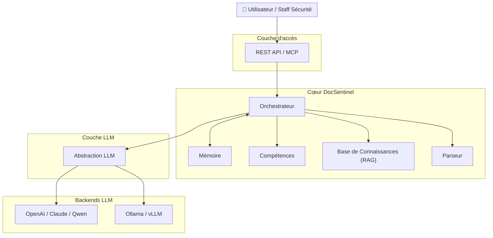

<div align="center">

[English](README.md) | [简体中文](README_zh.md) | [日本語](README_ja.md) | [한국어](README_ko.md) | [Français](README_fr.md) | [Deutsch](README_de.md)

</div>

<p align="center">
  
</p>

<p align="center">
  <strong>DocSentinel</strong><br/>
  <em>Évaluation de sécurité automatisée pour documents et questionnaires</em>
</p>

<p align="center">
  <a href="https://github.com/arthurpanhku/DocSentinel/releases"></a>
  <a href="https://github.com/arthurpanhku/DocSentinel/blob/main/LICENSE"></a>
  <a href="https://www.python.org/downloads/"></a>
  <a href="https://github.com/arthurpanhku/DocSentinel"></a>
  <a href="docs/06-agent-integration.md"></a>
  <a href="docs/06-agent-integration.md"></a>
</p>

<p align="center">
  <a href="https://glama.ai/mcp/servers/arthurpanhku/docsentinel">
    
  </a>
</p>

---

## Qu'est-ce qu'DocSentinel ?

**DocSentinel** est un assistant IA pour les équipes de sécurité. Il automatise la revue de **documents, formulaires et rapports** liés à la sécurité (ex : questionnaires de sécurité, documents de conception, preuves de conformité), les compare à vos politiques et à votre base de connaissances, et produit des **rapports d'évaluation structurés** avec les risques, les écarts de conformité et des suggestions de remédiation.

🚀 **Agent Ready** : Supporte le **Model Context Protocol (MCP)** pour être utilisé comme une "compétence" par OpenClaw, Claude Desktop et d'autres agents autonomes.

-   **Entrée multi-formats** : PDF, Word, Excel, PPT, texte — analysés dans un format unifié pour le LLM.
-   **Base de connaissances (RAG)** : Téléchargez des politiques et des documents de conformité ; l'agent les utilise comme référence lors de l'évaluation.
-   **Multi-LLM** : Utilisez OpenAI, Claude, Qwen ou **Ollama** (local) via une interface unique.
-   **Sortie structurée** : Rapports JSON/Markdown avec éléments de risque, écarts de conformité et remédiations exploitables.

Idéal pour les entreprises qui doivent faire évoluer les évaluations de sécurité sur de nombreux projets sans augmenter proportionnellement les effectifs.

---

## Pourquoi DocSentinel ?

| Point de douleur (Pain Point)                                                                                                                            | Solution DocSentinel                                                                                                             |
| :------------------------------------------------------------------------------------------------------------------------------------------------------- | :-------------------------------------------------------------------------------------------------------------------------------- |
| **Critères fragmentés**<br>Les politiques, normes et précédents sont dispersés.                                                                          | Une **base de connaissances** unique assure des résultats cohérents et une traçabilité.                                           |
| **Flux de questionnaire lourd**<br>Le métier remplit le formulaire → La sécurité examine → Le métier ajoute des preuves → La sécurité examine à nouveau. | **L'évaluation automatisée** et l'analyse des écarts réduisent les allers-retours manuels.                                        |
| **Pression de revue avant lancement**<br>La sécurité doit examiner et valider de nombreux documents techniques avant le lancement.                       | Les **rapports structurés** aident les examinateurs à se concentrer sur la prise de décision, pas sur la lecture ligne par ligne. |
| **Échelle vs cohérence**<br>De nombreux projets et normes entraînent des examens manuels incohérents ou retardés.                                        | Un **pipeline unifié** avec des scénarios configurables maintient les évaluations cohérentes et auditables.                       |

*Voir l'énoncé complet du problème et les objectifs du produit dans [SPEC.md](./SPEC.md).*

---

## Architecture

DocSentinel est construit autour d'un **orchestrateur** qui coordonne l'analyse, la base de connaissances (RAG), les compétences et le LLM. Vous pouvez utiliser des LLM cloud ou locaux et des intégrations optionnelles (ex : AAD, ServiceNow) selon les besoins de votre environnement.




**Flux de données (simplifié) :**

1.  L'utilisateur télécharge des documents et sélectionne un scénario.
2.  Le **Parseur** convertit les fichiers (PDF, Word, Excel, PPT, etc.) en texte/Markdown.
3.  L'**Orchestrateur** charge les morceaux de la **KB** (RAG) et invoque les **Compétences**.
4.  Le **LLM** (OpenAI, Ollama, etc.) produit des conclusions structurées.
5.  Renvoie le **rapport d'évaluation** (risques, écarts, remédiations).

*Architecture détaillée : [ARCHITECTURE.md](./ARCHITECTURE.md) et [docs/01-architecture-and-tech-stack.md](./docs/01-architecture-and-tech-stack.md).*

---

## Fonctionnalités

| Domaine                   | Capacités                                                                     |
| :------------------------ | :---------------------------------------------------------------------------- |
| **Analyse**               | Word, PDF, Excel, PPT, Texte → Markdown/JSON.                                 |
| **Base de Connaissances** | Téléchargement multi-formats, découpage, vectorisation (Chroma), requête RAG. |
| **Évaluation**            | Soumettre des fichiers → rapport structuré (risques, écarts, remédiations).   |
| **LLM**                   | Fournisseur configurable : **Ollama** (local), OpenAI, etc.                   |
| **API**                   | API REST & **Serveur MCP** pour l'intégration d'agents.                       |
| **Sécurité**              | RBAC intégré, journaux d'audit et protections contre l'injection de prompt.   |
| **Intégration**           | Supporte **MCP** pour OpenClaw, Claude Desktop, etc.                          |

Feuille de route (ex : intégration AAD/SSO, ServiceNow) dans [SPEC.md](./SPEC.md).

---

## 👀 Aperçu des fonctionnalités

### 1. Atelier d'évaluation
Téléchargez des documents, sélectionnez un persona (ex : Auditeur SOC2) et obtenez une analyse des risques instantanée.


### 2. Rapport structuré
Vue claire des risques, des écarts de conformité et des étapes de remédiation.


### 3. Gestion de la base de connaissances
Téléchargez des documents de politique dans le RAG. L'agent les cite comme preuves.


---

## Démarrage rapide

### Option A : Déploiement en un clic (Recommandé)

Exécutez le script de déploiement pour démarrer la stack complète (API + Tableau de bord + Vector DB + Ollama optionnel).

```bash
git clone https://github.com/arthurpanhku/DocSentinel.git
cd DocSentinel
chmod +x deploy.sh
./deploy.sh
```

-   **Tableau de bord** : [http://localhost:8501](http://localhost:8501)
-   **Docs API** : [http://localhost:8000/docs](http://localhost:8000/docs)

### Option B : Docker Manuel

**Prérequis** : **Python 3.10+**. Optionnel : [Ollama](https://ollama.ai) (`ollama pull llama2`).

```bash
git clone https://github.com/arthurpanhku/DocSentinel.git
cd DocSentinel
python3 -m venv .venv
source .venv/bin/activate   # Windows: .venv\Scripts\activate
pip install -r requirements.txt
cp .env.example .env        # Modifier si nécessaire : LLM_PROVIDER=ollama ou openai
uvicorn app.main:app --reload --host 0.0.0.0 --port 8000
```

-   **Docs API** : [http://localhost:8000/docs](http://localhost:8000/docs) · **Santé** : [http://localhost:8000/health](http://localhost:8000/health)

---

### Exemple : soumettre une évaluation

Vous pouvez utiliser les fichiers d'exemple dans [examples/](examples/) pour essayer l'API.

```bash
# Utiliser un fichier d'exemple
curl -X POST "http://localhost:8000/api/v1/assessments" \
  -F "files=@examples/sample.txt" \
  -F "scenario_id=default"

# Réponse : { "task_id": "...", "status": "accepted" }
# Obtenir le résultat (remplacez TASK_ID par le task_id retourné)
curl "http://localhost:8000/api/v1/assessments/TASK_ID"
```

### Exemple : télécharger vers la KB et requêter

```bash
# Utiliser un exemple de politique
curl -X POST "http://localhost:8000/api/v1/kb/documents" -F "file=@examples/sample-policy.txt"

# Requêter la KB (RAG)
curl -X POST "http://localhost:8000/api/v1/kb/query" \
  -H "Content-Type: application/json" \
  -d '{"query": "What are the access control requirements?", "top_k": 5}'
```

---

## Structure du projet

```text
DocSentinel/
├── app/                  # Code de l'application
│   ├── api/              # Routes REST : évaluations, KB, santé
│   ├── agent/            # Orchestration & Pipeline d'évaluation
│   ├── core/             # Configuration (pydantic-settings)
│   ├── kb/               # Base de Connaissances (Chroma, découpage, RAG)
│   ├── llm/              # Abstraction LLM (OpenAI, Ollama)
│   ├── parser/           # Analyse de documents (PDF, Word, Excel, PPT, texte)
│   ├── models/           # Modèles Pydantic
│   └── main.py
├── tests/                # Tests automatisés (pytest)
├── examples/             # Fichiers d'exemple (questionnaires, politiques)
├── docs/                 # Documentation de conception & spécifications
│   ├── 01-architecture-and-tech-stack.md
│   ├── 02-api-specification.yaml
│   ├── 03-assessment-report-and-skill-contract.md
│   ├── 04-integration-guide.md
│   ├── 05-deployment-runbook.md
│   └── schemas/
├── .github/              # Modèles Issue/PR, CI (Actions)
├── Dockerfile
├── docker-compose.yml    # API uniquement
├── docker-compose.ollama.yml  # API + Ollama optionnel
├── CONTRIBUTING.md       # Guides de contribution
├── CODE_OF_CONDUCT.md    # Code de conduite
├── CHANGELOG.md
├── SPEC.md
├── LICENSE
├── SECURITY.md
├── requirements.txt
├── requirements-dev.txt  # Dépendances de développement
├── pytest.ini
└── .env.example
```

---

## Configuration

| Variable                                       | Description          | Défaut                              |
| :--------------------------------------------- | :------------------- | :---------------------------------- |
| `LLM_PROVIDER`                                 | `ollama` ou `openai` | `ollama`                            |
| `OLLAMA_BASE_URL` / `OLLAMA_MODEL`             | LLM Local            | `http://localhost:11434` / `llama2` |
| `OPENAI_API_KEY` / `OPENAI_MODEL`              | OpenAI               | —                                   |
| `CHROMA_PERSIST_DIR`                           | Chemin Vector DB     | `./data/chroma`                     |
| `UPLOAD_MAX_FILE_SIZE_MB` / `UPLOAD_MAX_FILES` | Limites d'upload     | `50` / `10`                         |

*Voir [.env.example](./.env.example) et [docs/05-deployment-runbook.md](./docs/05-deployment-runbook.md) pour toutes les options.*

---

## Documentation et PRD

-   **[ARCHITECTURE.md](./ARCHITECTURE.md)** — Architecture système : diagramme de haut niveau, vues Mermaid, conception des composants, flux de données, sécurité.
-   **[SPEC.md](./SPEC.md)** — Exigences produit : énoncé du problème, solution, fonctionnalités, contrôles de sécurité.
-   **[CHANGELOG.md](./CHANGELOG.md)** — Historique des versions ; [Releases](https://github.com/arthurpanhku/DocSentinel/releases).
-   **Docs de conception** [docs/](./docs/) : Architecture, spec API (OpenAPI), contrats, guides d'intégration (AAD, ServiceNow), manuel de déploiement. Liste de contrôle de lancement Q1 : [docs/LAUNCH-CHECKLIST.md](./docs/LAUNCH-CHECKLIST.md).

---

## Développement & Tests

Pour vérifier votre installation ou contribuer au projet, exécutez la suite de tests :

### Option A : Test en un clic (Recommandé)
Configure automatiquement un environnement de test et exécute toutes les vérifications.

```bash
chmod +x test_integration.sh
./test_integration.sh
```

### Option B : Manuel
```bash
# 1. Installer les dépendances de dev
pip install -r requirements-dev.txt

# 2. Exécuter tous les tests
pytest

# 3. Exécuter un test spécifique (ex : API Skills)
pytest tests/test_skills_api.py
```

## Contribuer

Les Issues et Pull Requests sont les bienvenus. Veuillez lire [CONTRIBUTING.md](CONTRIBUTING.md) pour la configuration, les tests et les directives de commit. En participant, vous acceptez le [CODE_OF_CONDUCT.md](CODE_OF_CONDUCT.md).

🤖 **Contribution assistée par IA** : Nous encourageons l'utilisation d'outils IA pour contribuer ! Consultez [CONTRIBUTING_WITH_AI.md](CONTRIBUTING_WITH_AI.md) pour les meilleures pratiques.

📜 **Soumettre un modèle de compétence** : Vous avez un excellent persona de sécurité ? Soumettez une [Issue de modèle de compétence](https://github.com/arthurpanhku/DocSentinel/issues/new?template=new_skill_template.md) ou ajoutez-le à `examples/templates/`. Nous accueillons des questionnaires de sécurité réels (anonymisés) pour améliorer nos modèles !

---

## Sécurité

-   **Signalement de vulnérabilités** : Voir [SECURITY.md](./SECURITY.md) pour une divulgation responsable.
-   **Exigences de sécurité** : Suit les contrôles de sécurité dans [SPEC §7.2](./SPEC.md).

---

## Licence

Ce projet est sous licence **MIT License** — voir le fichier [LICENSE](./LICENSE) pour plus de détails.

---

## Historique des étoiles

[](https://star-history.com/#arthurpanhku/DocSentinel&Date)

---

## Auteur et liens

-   **Auteur** : PAN CHAO (Arthur Pan)
-   **Dépôt** : [github.com/arthurpanhku/DocSentinel](https://github.com/arthurpanhku/DocSentinel)
-   **SPEC et docs de conception** : Voir les liens ci-dessus.

Si vous utilisez DocSentinel dans votre organisation ou si vous contribuez, nous aimerions avoir de vos nouvelles (par exemple via GitHub Discussions ou Issues).
