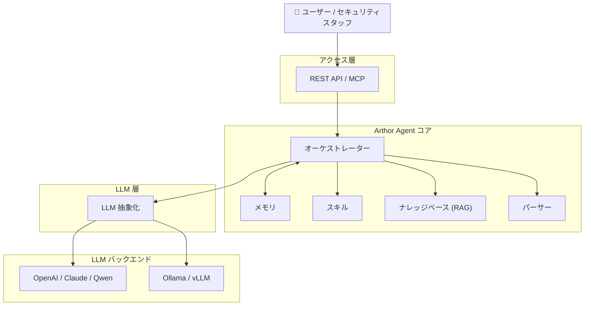

<div align="center">

[English](README.md) | [简体中文](README_zh.md) | [日本語](README_ja.md) | [한국어](README_ko.md) | [Français](README_fr.md) | [Deutsch](README_de.md)

</div>

<p align="center">
  
</p>

<p align="center">
  <strong>Arthor Agent</strong><br/>
  <em>文書およびアンケートの自動セキュリティ評価</em>
</p>

<p align="center">
  <a href="https://github.com/arthurpanhku/Arthor-Agent/releases"></a>
  <a href="https://github.com/arthurpanhku/Arthor-Agent/blob/main/LICENSE"></a>
  <a href="https://www.python.org/downloads/"></a>
  <a href="https://github.com/arthurpanhku/Arthor-Agent"></a>
  <a href="docs/06-agent-integration.md"></a>
  <a href="docs/06-agent-integration.md"></a>
</p>

---

## Arthor Agent とは？

**Arthor Agent** は、セキュリティチーム向けの AI アシスタントです。セキュリティ関連の**文書、フォーム、レポート**（セキュリティアンケート、設計書、コンプライアンス証跡など）のレビューを自動化し、ポリシーやナレッジベースと比較して、リスク項目、コンプライアンスギャップ、および修正提案を含む**構造化された評価レポート**を作成します。

🚀 **Agent Ready**: **Model Context Protocol (MCP)** をサポートしており、OpenClaw、Claude Desktop、その他の自律型エージェントから「スキル」として直接呼び出すことができます。

- **マルチフォーマット入力**: PDF、Word、Excel、PPT、テキスト — LLM 用に統一された形式に解析されます。
- **ナレッジベース (RAG)**: ポリシーやコンプライアンス文書をアップロードし、評価時の参照情報として使用します。
- **マルチ LLM サポート**: 統一インターフェースを通じて、OpenAI、Claude、Qwen、または **Ollama**（ローカル）を使用できます。
- **構造化出力**: リスク項目、コンプライアンスギャップ、および実行可能な修正提案を含む JSON/Markdown レポート。

多くのプロジェクトでセキュリティ評価を拡大する必要があるが、人員を比例して増やせない企業に最適です。

---

## なぜ Arthor Agent なのか？

| 課題 (Pain Point)                                                                                                | Arthor Agent の解決策 (Solution)                                                             |
| :--------------------------------------------------------------------------------------------------------------- | :------------------------------------------------------------------------------------------- |
| **評価基準の分散**<br>ポリシー、基準、過去の事例が散在している。                                                 | 単一の**ナレッジベース**により、一貫した評価と追跡可能性を確保します。                       |
| **重いアンケートワークフロー**<br>事業部門が記入 → セキュリティレビュー → 証拠追加 → 再レビュー。                | **自動化された一次評価**とギャップ分析により、手動でのやり取りを削減します。                 |
| **リリース前のレビュー圧力**<br>セキュリティ部門は、ローンチ前に大量の技術文書をレビューして承認する必要がある。 | **構造化レポート**により、レビュー担当者は一行ずつ読むのではなく、意思決定に集中できます。   |
| **規模と一貫性**<br>多くのプロジェクトや基準により、手動レビューが一貫性を欠いたり遅延したりする。               | **設定可能なシナリオ**と統一されたパイプラインにより、評価の一貫性と監査可能性を維持します。 |

*完全な問題提起と製品目標については、[SPEC.md](./SPEC.md)（製品要件と仕様）を参照してください。*

---

## アーキテクチャ

Arthor Agent は、解析、ナレッジベース (RAG)、スキル、および LLM を調整する**オーケストレーター**を中心に構築されています。環境に応じて、クラウドまたはローカルの LLM、およびオプションの統合（AAD、ServiceNow など）を使用できます。



**データフロー（簡略化）:**

1.  ユーザーがドキュメントをアップロードし、シナリオを選択します。
2.  **パーサー**がファイル（PDF、Word、Excel、PPT など）をテキスト/Markdown に変換します。
3.  **オーケストレーター**が **KB** チャンク (RAG) をロードし、**スキル**を呼び出します。
4.  **LLM** (OpenAI, Ollama 等) が構造化された結果を生成します。
5.  **評価レポート**（リスク、ギャップ、修正案）を返します。

*詳細なアーキテクチャ: [ARCHITECTURE.md](./ARCHITECTURE.md) および [docs/01-architecture-and-tech-stack.md](./docs/01-architecture-and-tech-stack.md)。*

---

## 機能概要

| 分野               | 能力                                                                            |
| :----------------- | :------------------------------------------------------------------------------ |
| **解析**           | Word, PDF, Excel, PPT, Text → Markdown/JSON。                                   |
| **ナレッジベース** | マルチフォーマットアップロード、チャンキング、ベクトル化 (Chroma)、RAG クエリ。 |
| **評価**           | ファイル提出 → 構造化レポート（リスク、ギャップ、修正案）。                     |
| **LLM**            | 設定可能なプロバイダー: **Ollama** (ローカル), OpenAI, 等。                     |
| **API**            | REST API & エージェント統合用 **MCP Server**。                                  |
| **セキュリティ**   | 組み込みの RBAC、監査ログ、プロンプトインジェクション保護。                     |
| **統合**           | OpenClaw, Claude Desktop 等のための **MCP** サポート。                          |

ロードマップ（例: AAD/SSO, ServiceNow 統合）は [SPEC.md](./SPEC.md) にあります。

---

## 👀 機能プレビュー

### 1. 評価ワークベンチ
ドキュメントをアップロードし、評価ペルソナ（例：SOC2 監査人）を選択して、即座にリスク分析を取得します。


### 2. 構造化レポート
リスク項目、コンプライアンスギャップ、および修正手順の明確なビュー。


### 3. ナレッジベース管理
ポリシー文書を RAG にアップロードします。エージェントはこれらを証拠として引用します。


---

## クイックスタート

### 方法 A: ワンクリックデプロイ（推奨）

デプロイスクリプトを実行して、フルスタック（API + ダッシュボード + ベクトル DB + オプションの Ollama）を開始します。

```bash
git clone https://github.com/arthurpanhku/Arthor-Agent.git
cd Arthor-Agent
chmod +x deploy.sh
./deploy.sh
```

-   **ダッシュボード**: [http://localhost:8501](http://localhost:8501)
-   **API ドキュメント**: [http://localhost:8000/docs](http://localhost:8000/docs)

### 方法 B: 手動 Docker

**前提条件**: **Python 3.10+**. オプション: [Ollama](https://ollama.ai) (`ollama pull llama2`).

```bash
git clone https://github.com/arthurpanhku/Arthor-Agent.git
cd Arthor-Agent
python3 -m venv .venv
source .venv/bin/activate   # Windows: .venv\Scripts\activate
pip install -r requirements.txt
cp .env.example .env        # 必要に応じて編集: LLM_PROVIDER=ollama or openai
uvicorn app.main:app --reload --host 0.0.0.0 --port 8000
```

-   **API docs**: [http://localhost:8000/docs](http://localhost:8000/docs) · **Health**: [http://localhost:8000/health](http://localhost:8000/health)

---

### 例：評価の提出

リポジトリ内の [examples/](examples/) にあるサンプルファイルを使用して、API を試すことができます。

```bash
# サンプルファイルを使用
curl -X POST "http://localhost:8000/api/v1/assessments" \
  -F "files=@examples/sample.txt" \
  -F "scenario_id=default"

# レスポンス: { "task_id": "...", "status": "accepted" }
# 結果を取得 (TASK_ID を返された task_id に置き換えてください)
curl "http://localhost:8000/api/v1/assessments/TASK_ID"
```

### 例：KB へのアップロードとクエリ

```bash
# サンプルポリシーを使用
curl -X POST "http://localhost:8000/api/v1/kb/documents" -F "file=@examples/sample-policy.txt"

# KB をクエリ (RAG)
curl -X POST "http://localhost:8000/api/v1/kb/query" \
  -H "Content-Type: application/json" \
  -d '{"query": "What are the access control requirements?", "top_k": 5}'
```

---

## プロジェクト構成

```text
Arthor-Agent/
├── app/                  # アプリケーションコード
│   ├── api/              # REST ルート: 評価, KB, ヘルスチェック
│   ├── agent/            # オーケストレーション & 評価パイプライン
│   ├── core/             # 設定 (pydantic-settings)
│   ├── kb/               # ナレッジベース (Chroma, chunking, RAG)
│   ├── llm/              # LLM 抽象化 (OpenAI, Ollama)
│   ├── parser/           # ドキュメント解析 (PDF, Word, Excel, PPT, text)
│   ├── models/           # Pydantic モデル
│   └── main.py
├── tests/                # 自動テスト (pytest)
├── examples/             # サンプルファイル (アンケート, ポリシー)
├── docs/                 # 設計 & 仕様ドキュメント
│   ├── 01-architecture-and-tech-stack.md
│   ├── 02-api-specification.yaml
│   ├── 03-assessment-report-and-skill-contract.md
│   ├── 04-integration-guide.md
│   ├── 05-deployment-runbook.md
│   └── schemas/
├── .github/              # Issue/PR テンプレート, CI (Actions)
├── Dockerfile
├── docker-compose.yml    # API のみ
├── docker-compose.ollama.yml  # API + Ollama (オプション)
├── CONTRIBUTING.md       # 貢献ガイドライン
├── CODE_OF_CONDUCT.md    # 行動規範
├── CHANGELOG.md
├── SPEC.md
├── LICENSE
├── SECURITY.md
├── requirements.txt
├── requirements-dev.txt  # 開発依存関係
├── pytest.ini
└── .env.example
```

---

## 設定

| 変数                                           | 説明                     | デフォルト                          |
| :--------------------------------------------- | :----------------------- | :---------------------------------- |
| `LLM_PROVIDER`                                 | `ollama` または `openai` | `ollama`                            |
| `OLLAMA_BASE_URL` / `OLLAMA_MODEL`             | ローカル LLM             | `http://localhost:11434` / `llama2` |
| `OPENAI_API_KEY` / `OPENAI_MODEL`              | OpenAI                   | —                                   |
| `CHROMA_PERSIST_DIR`                           | ベクトル DB パス         | `./data/chroma`                     |
| `UPLOAD_MAX_FILE_SIZE_MB` / `UPLOAD_MAX_FILES` | アップロード制限         | `50` / `10`                         |

*完全なオプションについては、[.env.example](./.env.example) および [docs/05-deployment-runbook.md](./docs/05-deployment-runbook.md) を参照してください。*

---

## ドキュメントと PRD

-   **[ARCHITECTURE.md](./ARCHITECTURE.md)** — システムアーキテクチャ: 高レベル図、Mermaid ビュー、コンポーネント設計、データフロー、セキュリティ。
-   **[SPEC.md](./SPEC.md)** — 製品要件と仕様: 問題提起、ソリューション、機能、セキュリティコントロール。
-   **[CHANGELOG.md](./CHANGELOG.md)** — バージョン履歴; [リリース](https://github.com/arthurpanhku/Arthor-Agent/releases)。
-   **設計ドキュメント** [docs/](./docs/)：アーキテクチャ、API 仕様 (OpenAPI)、契約、統合ガイド (AAD, ServiceNow)、デプロイ手順書。Q1 ローンチチェックリスト: [docs/LAUNCH-CHECKLIST.md](./docs/LAUNCH-CHECKLIST.md)。

---

## 開発とテスト

インストールを確認したり、プロジェクトに貢献したりするには、テストスイートを実行します:

### 方法 A: ワンクリックテスト（推奨）
テスト環境を自動的にセットアップし、すべてのチェックを実行します。

```bash
chmod +x test_integration.sh
./test_integration.sh
```

### 方法 B: 手動
```bash
# 1. 開発依存関係をインストール
pip install -r requirements-dev.txt

# 2. すべてのテストを実行
pytest

# 3. 特定のテストを実行 (例: Skills API)
pytest tests/test_skills_api.py
```

## 貢献

Issue や Pull Request を歓迎します。セットアップ、テスト、コミットガイドラインについては [CONTRIBUTING.md](CONTRIBUTING.md) をお読みください。参加することにより、[CODE_OF_CONDUCT.md](CODE_OF_CONDUCT.md) に同意したことになります。

🤖 **AI 支援による貢献**: AI ツールを使用した貢献を奨励しています！ベストプラクティスについては [CONTRIBUTING_WITH_AI.md](CONTRIBUTING_WITH_AI.md) をご覧ください。

📜 **スキルテンプレートの提出**: 優れたセキュリティペルソナをお持ちですか？[スキルテンプレート Issue](https://github.com/arthurpanhku/Arthor-Agent/issues/new?template=new_skill_template.md) を提出するか、`examples/templates/` に追加してください。テンプレートを改善するために、実際の（サニタイズされた）セキュリティアンケートを歓迎します！

---

## セキュリティ

-   **脆弱性報告**: 責任ある開示については [SECURITY.md](./SECURITY.md) を参照してください。
-   **セキュリティ要件**: [SPEC §7.2](./SPEC.md) で定義されているセキュリティコントロール（アイデンティティ、データ保護、アプリケーションセキュリティ、運用、サプライチェーン）に従います。

---

## ライセンス

このプロジェクトは **MIT License** の下でライセンスされています。詳細は [LICENSE](./LICENSE) ファイルを参照してください。

---

## Star History

[](https://star-history.com/#arthurpanhku/Arthor-Agent&Date)

---

## 著者とリンク

-   **著者**: PAN CHAO (Arthur Pan)
-   **リポジトリ**: [github.com/arthurpanhku/Arthor-Agent](https://github.com/arthurpanhku/Arthor-Agent)
-   **SPEC と設計ドキュメント**: 上記のリンクを参照してください。

組織で Arthor Agent を使用している場合や、貢献したい場合は、ぜひご連絡ください（GitHub Discussions や Issues など）。
