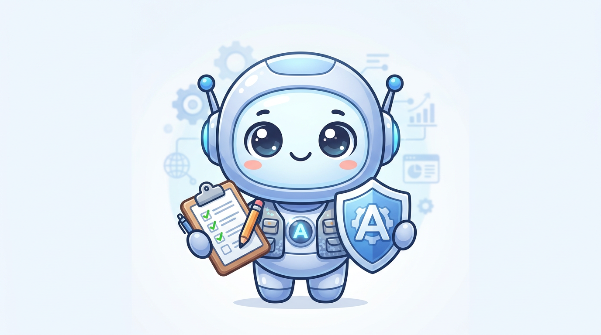
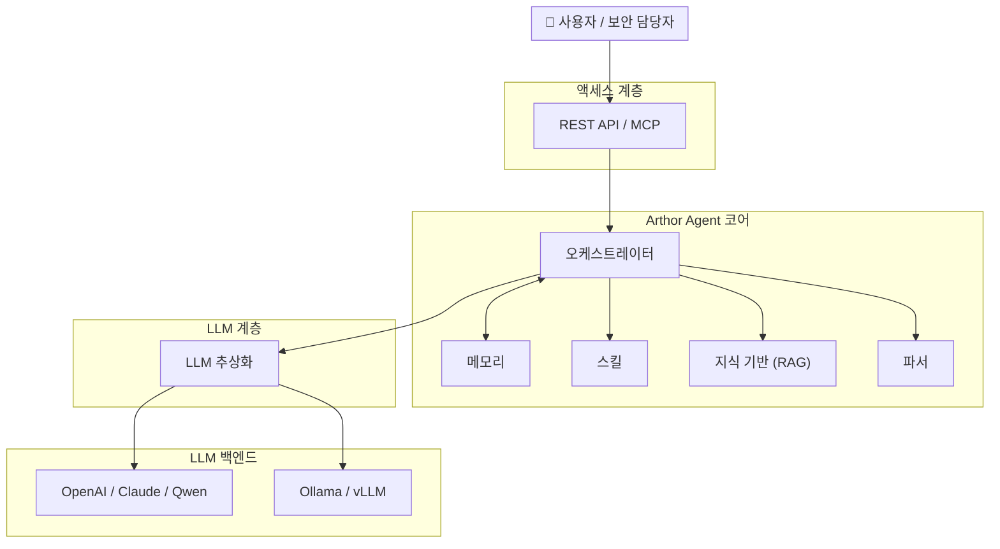

<div align="center">

[English](README.md) | [简体中文](README_zh.md) | [日本語](README_ja.md) | [한국어](README_ko.md) | [Français](README_fr.md) | [Deutsch](README_de.md)

</div>

<p align="center">
  
</p>

<p align="center">
  <strong>Arthor Agent</strong><br/>
  <em>문서 및 설문지의 자동 보안 평가</em>
</p>

<p align="center">
  <a href="https://github.com/arthurpanhku/Arthor-Agent/releases"></a>
  <a href="https://github.com/arthurpanhku/Arthor-Agent/blob/main/LICENSE"></a>
  <a href="https://www.python.org/downloads/"></a>
  <a href="https://github.com/arthurpanhku/Arthor-Agent"></a>
  <a href="docs/06-agent-integration.md"></a>
  <a href="docs/06-agent-integration.md"></a>
</p>

---

## Arthor Agent란 무엇인가요?

**Arthor Agent**는 보안 팀을 위한 AI 어시스턴트입니다. 보안 관련 **문서, 양식 및 보고서** (예: 보안 설문지, 설계 문서, 규정 준수 증거)의 검토를 자동화하고, 정책 및 지식 기반과 비교하여 위험 항목, 규정 준수 격차 및 개선 제안이 포함된 **구조화된 평가 보고서**를 생성합니다.

🚀 **Agent Ready**: **Model Context Protocol (MCP)**를 지원하여 OpenClaw, Claude Desktop 및 기타 자율 에이전트에서 "스킬"로 직접 호출할 수 있습니다.

- **다중 형식 입력**: PDF, Word, Excel, PPT, 텍스트 — LLM을 위해 통일된 형식으로 파싱됩니다.
- **지식 기반 (RAG)**: 정책 및 규정 준수 문서를 업로드하여 평가 시 참조 자료로 사용합니다.
- **다중 LLM 지원**: 단일 인터페이스를 통해 OpenAI, Claude, Qwen 또는 **Ollama** (로컬)를 사용할 수 있습니다.
- **구조화된 출력**: 위험 항목, 규정 준수 격차 및 실행 가능한 개선 제안이 포함된 JSON/Markdown 보고서.

많은 프로젝트에서 보안 평가를 확장해야 하지만 인력을 비례하여 늘릴 수 없는 기업에 이상적입니다.

---

## 왜 Arthor Agent인가요?

| 문제점 (Pain Point)                                                                    | Arthor Agent의 해결책 (Solution)                                                         |
| :------------------------------------------------------------------------------------- | :--------------------------------------------------------------------------------------- |
| **평가 기준의 분산**<br>정책, 표준 및 선례가 흩어져 있음.                              | 단일 **지식 기반**이 일관된 평가와 추적 가능성을 보장합니다.                             |
| **무거운 설문 워크플로우**<br>사업부 작성 → 보안 검토 → 증거 추가 → 재검토.            | **자동화된 1차 평가** 및 격차 분석으로 수동 반복을 줄입니다.                             |
| **출시 전 검토 압박**<br>보안 팀은 출시 전에 대량의 기술 문서를 검토하고 승인해야 함.  | **구조화된 보고서**를 통해 검토자는 한 줄씩 읽는 대신 의사 결정에 집중할 수 있습니다.    |
| **규모와 일관성**<br>많은 프로젝트와 표준으로 인해 수동 검토가 일관성이 없거나 지연됨. | **구성 가능한 시나리오**와 통합 파이프라인으로 평가의 일관성과 감사 가능성을 유지합니다. |

*전체 문제 정의 및 제품 목표는 [SPEC.md](./SPEC.md) (제품 요구 사항 및 사양)을 참조하세요.*

---

## 아키텍처

Arthor Agent는 파싱, 지식 기반 (RAG), 스킬 및 LLM을 조정하는 **오케스트레이터**를 중심으로 구축되었습니다. 환경에 따라 클라우드 또는 로컬 LLM 및 선택적 통합 (예: AAD, ServiceNow)을 사용할 수 있습니다.



**데이터 흐름 (간소화):**

1.  사용자가 문서를 업로드하고 시나리오를 선택합니다.
2.  **파서**가 파일 (PDF, Word, Excel, PPT 등)을 텍스트/Markdown으로 변환합니다.
3.  **오케스트레이터**가 **KB** 청크 (RAG)를 로드하고 **스킬**을 호출합니다.
4.  **LLM** (OpenAI, Ollama 등)이 구조화된 결과를 생성합니다.
5.  **평가 보고서** (위험, 격차, 개선안)를 반환합니다.

*상세 아키텍처: [ARCHITECTURE.md](./ARCHITECTURE.md) 및 [docs/01-architecture-and-tech-stack.md](./docs/01-architecture-and-tech-stack.md).*

---

## 기능 개요

| 영역          | 기능                                               |
| :------------ | :------------------------------------------------- |
| **파싱**      | Word, PDF, Excel, PPT, 텍스트 → Markdown/JSON.     |
| **지식 기반** | 다중 형식 업로드, 청킹, 벡터화 (Chroma), RAG 쿼리. |
| **평가**      | 파일 제출 → 구조화된 보고서 (위험, 격차, 개선안).  |
| **LLM**       | 구성 가능한 공급자: **Ollama** (로컬), OpenAI 등.  |
| **API**       | REST API & 에이전트 통합용 **MCP Server**.         |
| **보안**      | 내장된 RBAC, 감사 로그, 프롬프트 인젝션 보호.      |
| **통합**      | OpenClaw, Claude Desktop 등을 위한 **MCP** 지원.   |

로드맵 (예: AAD/SSO, ServiceNow 통합)은 [SPEC.md](./SPEC.md)에 있습니다.

---

## 👀 기능 미리보기

### 1. 평가 워크벤치
문서를 업로드하고 평가 페르소나 (예: SOC2 감사자)를 선택하여 즉시 위험 분석을 받습니다.


### 2. 구조화된 보고서
위험 항목, 규정 준수 격차 및 개선 단계에 대한 명확한 보기.


### 3. 지식 기반 관리
정책 문서를 RAG에 업로드합니다. 에이전트는 이를 증거로 인용합니다.


---

## 빠른 시작

### 방법 A: 원클릭 배포 (권장)

배포 스크립트를 실행하여 전체 스택 (API + 대시보드 + 벡터 DB + 선택적 Ollama)을 시작합니다.

```bash
git clone https://github.com/arthurpanhku/Arthor-Agent.git
cd Arthor-Agent
chmod +x deploy.sh
./deploy.sh
```

-   **대시보드**: [http://localhost:8501](http://localhost:8501)
-   **API 문서**: [http://localhost:8000/docs](http://localhost:8000/docs)

### 방법 B: 수동 Docker

**전제 조건**: **Python 3.10+**. 선택 사항: [Ollama](https://ollama.ai) (`ollama pull llama2`).

```bash
git clone https://github.com/arthurpanhku/Arthor-Agent.git
cd Arthor-Agent
python3 -m venv .venv
source .venv/bin/activate   # Windows: .venv\Scripts\activate
pip install -r requirements.txt
cp .env.example .env        # 필요 시 편집: LLM_PROVIDER=ollama 또는 openai
uvicorn app.main:app --reload --host 0.0.0.0 --port 8000
```

-   **API 문서**: [http://localhost:8000/docs](http://localhost:8000/docs) · **상태**: [http://localhost:8000/health](http://localhost:8000/health)

---

### 예시: 평가 제출

리포지토리 내 [examples/](examples/)에 있는 샘플 파일을 사용하여 API를 테스트할 수 있습니다.

```bash
# 샘플 파일 사용
curl -X POST "http://localhost:8000/api/v1/assessments" \
  -F "files=@examples/sample.txt" \
  -F "scenario_id=default"

# 응답: { "task_id": "...", "status": "accepted" }
# 결과 가져오기 (TASK_ID를 반환된 task_id로 교체하세요)
curl "http://localhost:8000/api/v1/assessments/TASK_ID"
```

### 예시: KB 업로드 및 쿼리

```bash
# 샘플 정책 사용
curl -X POST "http://localhost:8000/api/v1/kb/documents" -F "file=@examples/sample-policy.txt"

# KB 쿼리 (RAG)
curl -X POST "http://localhost:8000/api/v1/kb/query" \
  -H "Content-Type: application/json" \
  -d '{"query": "What are the access control requirements?", "top_k": 5}'
```

---

## 프로젝트 구조

```text
Arthor-Agent/
├── app/                  # 애플리케이션 코드
│   ├── api/              # REST 라우트: 평가, KB, 상태 확인
│   ├── agent/            # 오케스트레이션 & 평가 파이프라인
│   ├── core/             # 구성 (pydantic-settings)
│   ├── kb/               # 지식 기반 (Chroma, 청킹, RAG)
│   ├── llm/              # LLM 추상화 (OpenAI, Ollama)
│   ├── parser/           # 문서 파싱 (PDF, Word, Excel, PPT, 텍스트)
│   ├── models/           # Pydantic 모델
│   └── main.py
├── tests/                # 자동화 테스트 (pytest)
├── examples/             # 샘플 파일 (설문지, 정책)
├── docs/                 # 설계 & 사양 문서
│   ├── 01-architecture-and-tech-stack.md
│   ├── 02-api-specification.yaml
│   ├── 03-assessment-report-and-skill-contract.md
│   ├── 04-integration-guide.md
│   ├── 05-deployment-runbook.md
│   └── schemas/
├── .github/              # Issue/PR 템플릿, CI (Actions)
├── Dockerfile
├── docker-compose.yml    # API 전용
├── docker-compose.ollama.yml  # API + Ollama (선택)
├── CONTRIBUTING.md       # 기여 가이드라인
├── CODE_OF_CONDUCT.md    # 행동 강령
├── CHANGELOG.md
├── SPEC.md
├── LICENSE
├── SECURITY.md
├── requirements.txt
├── requirements-dev.txt  # 개발 의존성
├── pytest.ini
└── .env.example
```

---

## 구성

| 변수                                           | 설명                   | 기본값                              |
| :--------------------------------------------- | :--------------------- | :---------------------------------- |
| `LLM_PROVIDER`                                 | `ollama` 또는 `openai` | `ollama`                            |
| `OLLAMA_BASE_URL` / `OLLAMA_MODEL`             | 로컬 LLM               | `http://localhost:11434` / `llama2` |
| `OPENAI_API_KEY` / `OPENAI_MODEL`              | OpenAI                 | —                                   |
| `CHROMA_PERSIST_DIR`                           | 벡터 DB 경로           | `./data/chroma`                     |
| `UPLOAD_MAX_FILE_SIZE_MB` / `UPLOAD_MAX_FILES` | 업로드 제한            | `50` / `10`                         |

*전체 옵션은 [.env.example](./.env.example) 및 [docs/05-deployment-runbook.md](./docs/05-deployment-runbook.md)를 참조하세요.*

---

## 문서 및 PRD

-   **[ARCHITECTURE.md](./ARCHITECTURE.md)** — 시스템 아키텍처: 고수준 다이어그램, Mermaid 뷰, 컴포넌트 설계, 데이터 흐름, 보안.
-   **[SPEC.md](./SPEC.md)** — 제품 요구 사항 및 사양: 문제 정의, 솔루션, 기능, 보안 제어.
-   **[CHANGELOG.md](./CHANGELOG.md)** — 버전 기록; [릴리스](https://github.com/arthurpanhku/Arthor-Agent/releases).
-   **설계 문서** [docs/](./docs/)：아키텍처, API 사양 (OpenAPI), 계약, 통합 가이드 (AAD, ServiceNow), 배포 런북. Q1 출시 체크리스트: [docs/LAUNCH-CHECKLIST.md](./docs/LAUNCH-CHECKLIST.md).

---

## 개발 및 테스트

설치를 확인하거나 프로젝트에 기여하려면 테스트 스위트를 실행하세요:

### 방법 A: 원클릭 테스트 (권장)
테스트 환경을 자동으로 설정하고 모든 검사를 실행합니다.

```bash
chmod +x test_integration.sh
./test_integration.sh
```

### 방법 B: 수동
```bash
# 1. 개발 의존성 설치
pip install -r requirements-dev.txt

# 2. 모든 테스트 실행
pytest

# 3. 특정 테스트 실행 (예: Skills API)
pytest tests/test_skills_api.py
```

## 기여

이슈 및 풀 리퀘스트를 환영합니다. 설정, 테스트, 커밋 가이드라인은 [CONTRIBUTING.md](CONTRIBUTING.md)를 읽어주세요. 참여함으로써 [CODE_OF_CONDUCT.md](CODE_OF_CONDUCT.md)에 동의하게 됩니다.

🤖 **AI 지원 기여**: AI 도구를 사용한 기여를 장려합니다! 모범 사례는 [CONTRIBUTING_WITH_AI.md](CONTRIBUTING_WITH_AI.md)를 확인하세요.

📜 **스킬 템플릿 제출**: 훌륭한 보안 페르소나가 있나요? [스킬 템플릿 이슈](https://github.com/arthurpanhku/Arthor-Agent/issues/new?template=new_skill_template.md)를 제출하거나 `examples/templates/`에 추가하세요. 템플릿 개선을 위해 실제 (비식별화된) 보안 설문지를 환영합니다!

---

## 보안

-   **취약점 보고**: 책임 있는 공개에 대해서는 [SECURITY.md](./SECURITY.md)를 참조하세요.
-   **보안 요구 사항**: [SPEC §7.2](./SPEC.md)에 정의된 보안 제어 (ID, 데이터 보호, 애플리케이션 보안, 운영, 공급망)를 따릅니다.

---

## 라이선스

이 프로젝트는 **MIT License**에 따라 라이선스가 부여됩니다. 자세한 내용은 [LICENSE](./LICENSE) 파일을 참조하세요.

---

## 스타 기록

[](https://star-history.com/#arthurpanhku/Arthor-Agent&Date)

---

## 저자 및 링크

-   **저자**: PAN CHAO (Arthur Pan)
-   **저장소**: [github.com/arthurpanhku/Arthor-Agent](https://github.com/arthurpanhku/Arthor-Agent)
-   **SPEC 및 설계 문서**: 위 링크 참조.

조직에서 Arthor Agent를 사용하거나 기여하고 싶으시면 언제든지 연락해 주세요 (예: GitHub Discussions 또는 Issues).
