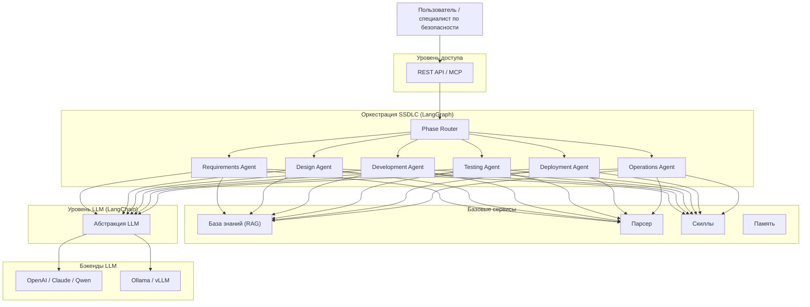

<div align="center">

[English](README.md) | [简体中文](README_zh.md) | [日本語](README_ja.md) | [한국어](README_ko.md) | [Français](README_fr.md) | [Deutsch](README_de.md) | [Русский](README_ru.md)

</div>

<p align="center">
  
</p>

<p align="center">
  <strong>DocSentinel</strong><br/>
  <em>SSDLC-платформа с искусственным интеллектом — защищайте программное обеспечение от стадии требований до эксплуатации</em>
</p>

<p align="center">
  <a href="https://github.com/arthurpanhku/DocSentinel/releases"></a>
  <a href="https://github.com/arthurpanhku/DocSentinel/blob/main/LICENSE"></a>
  <a href="https://www.python.org/downloads/"></a>
  <a href="https://github.com/arthurpanhku/DocSentinel"></a>
  <a href="docs/06-agent-integration.md"></a>
  <a href="docs/06-agent-integration.md"></a>
  <a href="https://python.langchain.com/"></a>
  <a href="https://langchain-ai.github.io/langgraph/"></a>
</p>

<p align="center">
  <a href="https://glama.ai/mcp/servers/arthurpanhku/DocSentinel">
    
  </a>
</p>

---

## Что такое DocSentinel?

**DocSentinel** — это **SSDLC-платформа (Secure Software Development Lifecycle) с искусственным интеллектом** для команд безопасности. Она автоматизирует операции по безопасности на всех шести этапах жизненного цикла разработки программного обеспечения с помощью интеллектуальных AI-агентов, оркестрируемых **LangGraph** и работающих на базе **LangChain**. Платформа автоматизирует ревью **документов, форм и отчётов** по безопасности — от требований и проектирования через разработку, тестирование, развёртывание и до эксплуатации — сопоставляя входные данные с вашими политиками и базой знаний и формируя **структурированные отчёты об оценке** с указанием рисков, пробелов в соответствии нормам и рекомендациями по устранению проблем.

Вместо того чтобы проверять документы только на стадии выпуска, DocSentinel встраивает безопасность с первого дня:

| Этап SSDLC | Что делает DocSentinel |
| :--- | :--- |
| **Требования** | Извлечение требований по безопасности, выявление обязательств по нормам (GDPR, PCI DSS, SOC2) |
| **Проектирование** | Автоматизированное моделирование угроз (STRIDE/DREAD), ревью архитектуры безопасности, отчёты SDR |
| **Разработка** | Оценка безопасности кода, триаж результатов SAST, рекомендации по кодированию |
| **Тестирование** | Анализ отчётов SAST/DAST, ревью пентестов, приоритизация уязвимостей |
| **Развёртывание** | Ревью безопасности конфигурации, оценка hardening, согласование релиза |
| **Эксплуатация** | Мониторинг уязвимостей, помощь в реагировании на инциденты, аудит логов |

Спроектированная как **headless API + MCP-сервис**, DocSentinel интегрируется в ваши пайплайны CI/CD, AI-агентов (Claude Desktop, Cursor, OpenClaw) и существующие процессы безопасности.

- **Оркестрация на LangGraph**: stateful workflow на основе графов с условным ветвлением по этапам SSDLC.
- **Мультиформатный ввод**: PDF, Word, Excel, PPT, текст — парсятся в единый формат для LLM.
- **База знаний (RAG)**: загружайте политики и нормативные документы; агент использует их как справочник при оценке.
- **Несколько LLM**: используйте OpenAI, Claude, Qwen или **Ollama** (локально) через единый интерфейс.
- **Структурированный вывод**: отчёты JSON/Markdown с пунктами риска, пробелами в нормах и рекомендациями к действиям.

Идеально для предприятий, которым нужно масштабировать оценку безопасности по многим проектам и этапам SSDLC без пропорционального наращивания штата.

---

## Зачем DocSentinel?

| Проблема | Решение DocSentinel |
| :--- | :--- |
| **Фрагментарное покрытие SSDLC**<br>Большинство инструментов работают только с тестированием/развёртыванием. | **Агенты полного жизненного цикла** покрывают все 6 этапов SSDLC с выделенными AI-персонами. |
| **Фрагментарные критерии**<br>Политики, стандарты и прецеденты разбросаны. | Единая **база знаний** обеспечивает согласованные находки и трассируемость. |
| **Нет автоматизированного моделирования угроз**<br>Модели угроз создаются ad-hoc. | **Design Agent** генерирует модели угроз STRIDE/DREAD из документов архитектуры. |
| **Тяжёлый процесс с опросниками**<br>Бесконечные циклы ревью. | **Автоматический первый проход** и анализ пробелов сокращают ручные туда-обратно итерации. |
| **Перегрузка отчётами SAST/DAST**<br>Слишком много находок, слишком мало контекста. | **Testing Agent** триажит, приоритизирует и привязывает находки к моделям угроз. |
| **Давление пре-релиза**<br>Всё валится на безопасность в самом конце. | Подход **shift-left** ловит проблемы раньше, на этапах требований и проектирования. **Структурированные отчёты** помогают ревьюверам сосредоточиться на принятии решений. |
| **Масштаб против согласованности**<br>Ручные ревью разнятся между ревьюверами. | **Workflow на LangGraph** и **единый пайплайн** обеспечивают согласованную, аудируемую оценку по всем проектам. |
| **Пробелы в покрытии SSDLC**<br>Безопасность вовлечена неравномерно на разных этапах; ранние этапы получают меньше внимания. | **Оценка с учётом этапа** покрывает все 6 этапов SSDLC с выделенными скиллами и чек-листами. |

*Полное описание проблемы и деталей этапов SSDLC см. в [SPEC.md](./SPEC.md).*

---

## Архитектура

DocSentinel построен на **LangGraph** для stateful-оркестрации агентов и **LangChain** для унифицированного доступа к LLM. Шесть фазово-ориентированных агентов координируются конечным автоматом на графе с разделяемым контекстом между фазами. Оркестратор координирует парсинг, маршрутизацию по этапам SSDLC, базу знаний (RAG), скиллы и LLM. Можно использовать облачные или локальные LLM и опциональные интеграции (например, AAD, ServiceNow) в зависимости от окружения.




**Поток данных (упрощённо):**

1.  Пользователь выбирает этап(ы) SSDLC и загружает документы (либо опционально позволяет SSDLC Router автоматически определить стадию).
2.  **Парсер** конвертирует файлы (PDF, Word, Excel, PPT, отчёты SAST/DAST и т.д.) в текст/Markdown.
3.  **Маршрутизатор LangGraph** направляет к соответствующим **Phase Agent(s)**, подгружая скилл и чек-лист для конкретного этапа.
4.  Phase Agent опрашивает **KB** (коллекции, специфичные для этапа) и применяет **Skills**; Policy и Evidence работают параллельно, затем Drafter и Reviewer.
5.  **LLM** (через LangChain) формирует структурированные находки с межфазной трассируемостью.
6.  Возвращается **отчёт об оценке** (риски, угрозы, пробелы, рекомендации, уверенность, этап SSDLC).

*Подробная архитектура: [ARCHITECTURE.md](./ARCHITECTURE.md) и [docs/01-architecture-and-tech-stack.md](./docs/01-architecture-and-tech-stack.md).*

---

## Основные возможности

### Полное покрытие жизненного цикла SSDLC
Шесть выделенных AI-агентов, каждый со своими фазовыми скиллами, промптами и коллекциями базы знаний. Можно запустить отдельные этапы или полный сквозной аудит SSDLC:
- **Требования**: требования по безопасности, сопоставление с нормами, начальный анализ рисков.
- **Проектирование**: ревью архитектуры, моделирование угроз STRIDE/DREAD, SDR.
- **Разработка**: стандарты безопасного кодирования, находки code review.
- **Тестирование**: триаж отчётов SAST/DAST, оценка пентестов.
- **Развёртывание**: готовность к релизу, безопасность конфигурации, hardening.
- **Эксплуатация**: реагирование на инциденты, мониторинг уязвимостей, аудит логов.

### Автоматизированная оценка безопасности
Отправьте опросники по безопасности, проектные документы или аудиторские отчёты. DocSentinel анализирует их через сконфигурированные LLM и выявляет:
- **Риски безопасности**: классифицированные по серьёзности (Critical, High, Medium, Low).
- **Пробелы в соответствии**: отсутствующие контроли относительно фреймворков типа ISO 27001, PCI DSS.

### Управление и соответствие
В DocSentinel добавлены возможности PallasGuard: policy packs, восемь публичных
compliance overlay, Gate 1/3-опросники, submission/approval workflow, аудит,
учёт доказательств и Pallas Lens для оценки готовности проекта.
- **Шаги по устранению**: конкретные рекомендации для исправления выявленных проблем.

### Интеллектуальная оркестрация агентов (LangGraph)
- **Stateful workflow**: конечный автомат LangGraph сохраняет контекст между фазами
- **Межфазная трассируемость**: угрозы из Design связаны с тест-кейсами в Testing и правилами мониторинга в Operations
- **Условная маршрутизация**: агенты активируются на основе уровня риска проекта, требований к соответствию или выбора пользователя
- **Human-in-the-loop**: точки прерывания для ручного ревью на границах фаз
- **Контрольные точки**: длительные оценки сохраняют состояние и возобновляются

### База знаний на основе RAG
Загружайте политики безопасности вашей организации, стандарты и прошлые аудиты. Фазовые коллекции гарантируют, что каждый агент получает наиболее релевантный контекст:
- Требования: фреймворки соответствия, политики безопасности
- Проектирование: каталоги угроз, паттерны безопасности
- Разработка: стандарты безопасного кодирования (OWASP)
- Тестирование: базы данных уязвимостей, руководства по устранению
- Развёртывание: бенчмарки CIS, руководства по hardening
- Эксплуатация: базы данных CVE, плейбуки реагирования на инциденты

### Оркестрация агентов LangGraph
На базе **LangChain + LangGraph** — stateful workflow на основе графов с условной маршрутизацией по этапам SSDLC. Параллельное выполнение Policy и Evidence агентов, затем Drafter и Reviewer.

### API-first и поддержка MCP
Спроектирован как headless-сервис. Интегрируйте в пайплайны CI/CD через REST API или используйте как **super-tool** внутри AI-агентов (Claude Desktop, Cursor, OpenClaw) через MCP.

---

## Интеграция с агентами (MCP)

Подключите DocSentinel к **Claude Desktop**, **Cursor** или **OpenClaw**, чтобы использовать его как мощный SSDLC-скилл по безопасности.

### Что это даёт?
После подключения вы можете попросить своего AI-агента:
> «Проанализируй вложенный `requirements.pdf` на наличие отсутствующих требований по безопасности с помощью DocSentinel.»
>
> «Проведи моделирование угроз STRIDE на `system-design.pdf` с помощью Design Agent.»
>
> «Сделай триаж этих находок SonarQube SAST и приоритизируй по риску.»

### Руководство по конфигурации

#### 1. Claude Desktop
Добавьте в ваш `claude_desktop_config.json`:
```json
{
  "mcpServers": {
    "docsentinel": {
      "command": "/path/to/DocSentinel/.venv/bin/python",
      "args": ["/path/to/DocSentinel/app/mcp_server.py"],
      "env": {
        "OPENAI_API_KEY": "sk-...",
        "CHROMA_PERSIST_DIR": "/absolute/path/to/data/chroma"
      }
    }
  }
}
```

#### 2. Cursor
1. Перейдите в **Settings > Features > MCP**.
2. Нажмите **+ Add New MCP Server**.
   - **Name**: `docsentinel`
   - **Type**: `stdio`
   - **Command**: `/path/to/DocSentinel/.venv/bin/python`
   - **Args**: `/path/to/DocSentinel/app/mcp_server.py`

*Полное руководство — в [docs/06-agent-integration.md](docs/06-agent-integration.md).*

---

## Быстрый старт

### Вариант A: развёртывание в один клик (рекомендуется)

```bash
git clone https://github.com/arthurpanhku/DocSentinel.git
cd DocSentinel
chmod +x deploy.sh
./deploy.sh
```

-   **Документация API**: [http://localhost:8000/docs](http://localhost:8000/docs)

### Вариант B: ручная установка

**Требования**: **Python 3.10+**. Опционально: [Ollama](https://ollama.ai) (`ollama pull llama2`).

```bash
git clone https://github.com/arthurpanhku/DocSentinel.git
cd DocSentinel
python3 -m venv .venv
source .venv/bin/activate   # Windows: .venv\Scripts\activate
pip install -r requirements.txt
cp .env.example .env        # При необходимости отредактируйте: LLM_PROVIDER=ollama или openai
uvicorn app.main:app --reload --host 0.0.0.0 --port 8000
```

-   **Документация API**: [http://localhost:8000/docs](http://localhost:8000/docs) · **Health**: [http://localhost:8000/health](http://localhost:8000/health)
-   **Консоль ревью (HITL)**: [http://localhost:8000/docs/review-console.html](http://localhost:8000/docs/review-console.html)

---

### Пример: отправить оценку SSDLC

```bash
# Запустить оценку фазы Design (моделирование угроз)
curl -X POST "http://localhost:8000/api/v1/assessments" \
  -F "files=@examples/architecture-doc.pdf" \
  -F "phase=design" \
  -F "scenario_id=threat-modeling"

# Ответ: { "task_id": "...", "status": "accepted" }
# Получить результат
curl "http://localhost:8000/api/v1/assessments/TASK_ID"
```

### Пример: загрузка в KB и запрос

```bash
# Загрузить политику безопасности в коллекцию requirements KB
curl -X POST "http://localhost:8000/api/v1/kb/documents" \
  -F "file=@examples/sample-policy.txt" \
  -F "collection=kb_requirements"

# Запрос к KB (RAG)
curl -X POST "http://localhost:8000/api/v1/kb/query" \
  -H "Content-Type: application/json" \
  -d '{"query": "Какие требования к контролю доступа?", "top_k": 5}'
```

---

## Хостинговое развёртывание

Хостинговое развёртывание доступно на [Fronteir AI](https://fronteir.ai/mcp/arthurpanhku-docsentinel).

## Структура проекта

```text
DocSentinel/
├── app/                  # Код приложения
│   ├── api/              # REST-маршруты: assessments, KB, health, skills
│   ├── agent/            # Оркестратор LangGraph, фазовые агенты, скиллы
│   │   ├── orchestrator.py    # Конечный автомат LangGraph и маршрутизация по фазам
│   │   ├── agents/            # Реализации фазовых агентов
│   │   ├── ssdlc/             # SSDLC-пайплайн: маршрутизатор этапов, скиллы этапов, чек-листы
│   │   ├── skills_registry.py # Встроенные скиллы по фазам SSDLC
│   │   └── skills_service.py  # CRUD и управление скиллами
│   ├── core/             # Конфигурация, guardrails, безопасность, БД
│   ├── kb/               # База знаний (Chroma + LightRAG graph RAG)
│   ├── llm/              # Абстракция LLM на LangChain (OpenAI, Ollama)
│   ├── parser/           # Парсинг документов (Docling + SAST/DAST + legacy)
│   ├── models/           # Модели Pydantic / SQLModel
│   ├── main.py           # Точка входа FastAPI
│   └── mcp_server.py     # MCP-сервер для интеграции с агентами
├── tests/                # Автоматические тесты (pytest)
├── examples/             # Примеры файлов (опросники, политики, отчёты)
├── docs/                 # Документация по дизайну и спецификации
│   ├── 01-architecture-and-tech-stack.md
│   ├── 02-api-specification.yaml
│   ├── 03-assessment-report-and-skill-contract.md
│   ├── 04-integration-guide.md
│   ├── 05-deployment-runbook.md
│   ├── 06-agent-integration.md
│   └── schemas/
├── .github/              # Шаблоны issue/PR, CI (Actions)
├── Dockerfile
├── docker-compose.yml
├── docker-compose.ollama.yml
├── CONTRIBUTING.md
├── CODE_OF_CONDUCT.md
├── CHANGELOG.md
├── SPEC.md               # PRD с определениями фаз SSDLC
├── ARCHITECTURE.md        # Архитектура системы с дизайном LangGraph
├── LICENSE
├── SECURITY.md
├── requirements.txt
├── requirements-dev.txt
└── .env.example
```

---

## Конфигурация

| Переменная | Описание | По умолчанию |
| :--- | :--- | :--- |
| `LLM_PROVIDER` | `ollama` или `openai` | `ollama` |
| `OLLAMA_BASE_URL` / `OLLAMA_MODEL` | Локальный LLM | `http://localhost:11434` / `llama2` |
| `OPENAI_API_KEY` / `OPENAI_MODEL` | OpenAI | -- |
| `CHROMA_PERSIST_DIR` | Путь к векторной БД | `./data/chroma` |
| `PARSER_ENGINE` | Парсер: `auto`, `docling` или `legacy` | `auto` |
| `ENABLE_GRAPH_RAG` | Включить graph retrieval LightRAG | `true` |
| `LANGGRAPH_CHECKPOINT_DIR` | Сохранение контрольных точек LangGraph | `./data/checkpoints` |
| `SSDLC_DEFAULT_PHASES` | Фазы по умолчанию для полной оценки | `requirements,design,development,testing,deployment,operations` |
| `SSDLC_DEFAULT_STAGE` | Этап SSDLC по умолчанию, если не указан | `auto` |
| `UPLOAD_MAX_FILE_SIZE_MB` / `UPLOAD_MAX_FILES` | Лимиты загрузки | `50` / `10` |

*См. [.env.example](./.env.example) и [docs/05-deployment-runbook.md](./docs/05-deployment-runbook.md) для полного списка опций.*

---

## Технологический стек

| Уровень | Технология | Назначение |
| :--- | :--- | :--- |
| **Оркестрация агентов** | LangGraph | Stateful движок workflow на основе графов для SSDLC |
| **Фреймворк LLM** | LangChain | Унифицированная абстракция LLM, промпты, инструменты, RAG |
| **Web/API** | FastAPI | Асинхронный REST API с автогенерацией OpenAPI |
| **Векторное хранилище** | ChromaDB + LightRAG | Гибридный векторный + графовый RAG |
| **Парсинг** | Docling + legacy fallback | Мультиформатный парсинг документов |
| **Провайдеры LLM** | OpenAI, Ollama | Поддержка облачных и локальных LLM |
| **Язык** | Python 3.10+ | Основной язык разработки |

---

## Документация и PRD

-   **[ARCHITECTURE.md](./ARCHITECTURE.md)** — Архитектура системы: дизайн LangGraph, SSDLC-агенты, поток данных, развёртывание.
-   **[SPEC.md](./SPEC.md)** — Требования к продукту: фазы SSDLC, функционал, контроли безопасности.
-   **[CHANGELOG.md](./CHANGELOG.md)** — История версий; [Releases](https://github.com/arthurpanhku/DocSentinel/releases).
-   **Документация по дизайну** [docs/](./docs/): архитектура, спецификация API (OpenAPI), контракты, гайды интеграции, runbook развёртывания.

---

## Разработка и тестирование

### Вариант A: тестирование в один клик (рекомендуется)
```bash
chmod +x test_integration.sh
./test_integration.sh
```

### Вариант B: вручную
```bash
pip install -r requirements-dev.txt
pytest
pytest tests/test_skills_api.py   # Запустить конкретный тест
```

## Контрибьюшн

Issues и Pull Request приветствуются. Прочитайте [CONTRIBUTING.md](CONTRIBUTING.md) для информации о настройке, тестах и правилах коммитов. Участвуя, вы соглашаетесь с [CODE_OF_CONDUCT.md](CODE_OF_CONDUCT.md).

Контрибьюшн с помощью AI: мы поощряем использование AI-инструментов! Прочитайте [CONTRIBUTING_WITH_AI.md](CONTRIBUTING_WITH_AI.md) для лучших практик.

Шаблон скилла: есть отличная security-персона для фазы SSDLC? Отправьте [Skill Template](https://github.com/arthurpanhku/DocSentinel/issues/new?template=new_skill_template.md) или добавьте её в `examples/templates/`.

---

## Безопасность

-   **Сообщение об уязвимостях**: см. [SECURITY.md](./SECURITY.md) для процесса ответственного раскрытия.
-   **Требования безопасности**: следует контролям безопасности в [SPEC §7.2](./SPEC.md).

---

## Лицензия

Этот проект распространяется под лицензией **MIT License** — подробности см. в файле [LICENSE](./LICENSE).

---

## История звёзд

[](https://star-history.com/#arthurpanhku/DocSentinel&Date)

---

## Автор и ссылки

-   **Автор**: PAN CHAO (Arthur Pan)
-   **Репозиторий**: [github.com/arthurpanhku/DocSentinel](https://github.com/arthurpanhku/DocSentinel)
-   **SPEC и проектные документы**: см. ссылки выше.

Если вы используете DocSentinel в своей организации или вносите вклад в проект, мы будем рады услышать вас (например, через GitHub Discussions или Issues).
