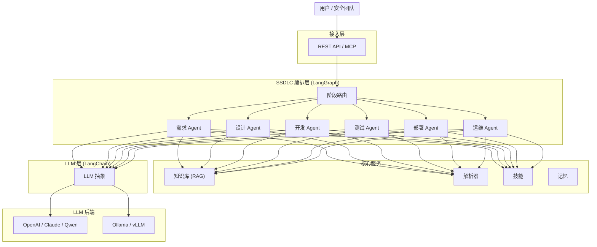

<div align="center">

[English](README.md) | [简体中文](README_zh.md) | [日本語](README_ja.md) | [한국어](README_ko.md) | [Français](README_fr.md) | [Deutsch](README_de.md)

</div>

<p align="center">
  
</p>

<p align="center">
  <strong>DocSentinel</strong><br/>
  <em>AI 驱动的 SSDLC 平台 — 从需求到运维，全生命周期守护软件安全</em>
</p>

<p align="center">
  <a href="https://github.com/arthurpanhku/DocSentinel/releases"></a>
  <a href="https://github.com/arthurpanhku/DocSentinel/blob/main/LICENSE"></a>
  <a href="https://www.python.org/downloads/"></a>
  <a href="https://github.com/arthurpanhku/DocSentinel"></a>
  <a href="docs/06-agent-integration.md"></a>
  <a href="https://python.langchain.com/"></a>
  <a href="https://langchain-ai.github.io/langgraph/"></a>
</p>

<p align="center">
  <a href="https://glama.ai/mcp/servers/arthurpanhku/DocSentinel">
    
  </a>
</p>

---

## DocSentinel 是什么？

**DocSentinel** 是面向安全团队的 **AI 驱动 SSDLC（安全软件开发生命周期）平台**。它使用由 **LangGraph** 编排、**LangChain** 驱动的智能 AI Agent，自动化覆盖软件开发生命周期全部六个阶段的安全活动。

不再只是上线前审阅文档，DocSentinel 从第一天起就嵌入安全：

| SSDLC 阶段 | DocSentinel 能力 |
| :--- | :--- |
| **需求阶段** | 提取安全需求，识别合规义务（GDPR、PCI DSS、SOC2） |
| **设计阶段** | 自动化威胁建模（STRIDE/DREAD），安全架构评审，SDR 报告 |
| **开发阶段** | 安全编码评估，SAST 结果分拣，安全编码指导 |
| **测试阶段** | SAST/DAST 报告分析，渗透测试审阅，漏洞优先级排序 |
| **部署阶段** | 配置安全审查，加固评估，发布签字 |
| **运维阶段** | 漏洞监控，应急响应辅助，日志审计 |

以 **Headless API + MCP 服务** 形式构建，可集成到 CI/CD 管道、AI 智能体（Claude Desktop、Cursor、OpenClaw）及现有安全工作流中。

---

## 为什么选择 DocSentinel？

| 痛点 | DocSentinel 方案 |
| :--- | :--- |
| **SSDLC 覆盖碎片化**<br>大多数工具只覆盖测试/部署阶段。 | **全生命周期 Agent** 覆盖 6 个 SSDLC 阶段，配备专属 AI 角色。 |
| **无自动化威胁建模**<br>威胁模型临时创建，缺乏结构化。 | **设计阶段 Agent** 从架构文档自动生成 STRIDE/DREAD 威胁模型。 |
| **问卷流程繁重**<br>多轮往返审阅。 | **自动化初评**与差距分析，减少人工审阅轮次。 |
| **SAST/DAST 报告泛滥**<br>发现太多，上下文太少。 | **测试阶段 Agent** 分拣、排序并关联到威胁模型。 |
| **上线前集中压力**<br>所有安全审查压到最后。 | **左移**策略在需求和设计阶段就发现问题。 |
| **规模与一致性矛盾**<br>人工评估因审阅者不同而不一致。 | **LangGraph 工作流**确保跨项目一致、可审计的评估。 |

*完整 SSDLC 阶段说明见 [SPEC.md](./SPEC.md)。*

---

## 架构

DocSentinel 基于 **LangGraph** 实现有状态的 Agent 编排，基于 **LangChain** 实现统一 LLM 访问。六个阶段专用 Agent 由图形化状态机协调，支持跨阶段上下文共享。




**数据流（简要）：**

1.  用户选择 SSDLC 阶段并上传文档。
2.  **LangGraph 路由器**分发到对应的**阶段 Agent**。
3.  **解析器**将文件（PDF、Word、Excel、SAST/DAST 报告等）转为文本/Markdown。
4.  阶段 Agent 检索**知识库**（阶段专属集合）并应用**技能**。
5.  **LLM**（通过 LangChain）生成结构化发现，支持跨阶段追溯。
6.  返回**评估报告**（风险、威胁、差距、整改建议）。

*详细架构见 [ARCHITECTURE.md](./ARCHITECTURE.md) 与 [docs/01-architecture-and-tech-stack.md](./docs/01-architecture-and-tech-stack.md)。*

---

## 核心能力

### SSDLC 全生命周期覆盖
六个专用 AI Agent，各配备阶段专属技能、提示词和知识库集合。支持单阶段运行或端到端全 SSDLC 评估。

### 智能 Agent 编排 (LangGraph)
- **有状态工作流**：LangGraph 状态机跨阶段维护上下文
- **跨阶段追溯**：设计阶段的威胁关联到测试阶段的测试用例和运维阶段的监控规则
- **条件路由**：Agent 根据项目风险等级、合规要求或用户选择激活
- **人机协作**：阶段边界设置中断点，供人工审阅
- **检查点**：长周期评估持久化状态，支持恢复

### RAG 驱动的知识库
上传组织内部安全策略、标准和历史审计报告。阶段专属集合确保每个 Agent 检索最相关的上下文：
- 需求阶段：合规框架、安全策略
- 设计阶段：威胁目录、安全模式
- 开发阶段：安全编码标准（OWASP）
- 测试阶段：漏洞数据库、修复指南
- 部署阶段：CIS 基线、加固指南
- 运维阶段：CVE 数据库、应急手册

### API 优先 & MCP 就绪
Headless 服务设计。通过 REST API 集成到 CI/CD 管道，或通过 MCP 作为 AI 智能体（Claude Desktop、Cursor、OpenClaw）的技能使用。

---

## Agent 集成 (MCP)

将 DocSentinel 连接到 **Claude Desktop**、**Cursor** 或 **OpenClaw**，作为强大的 SSDLC 安全技能使用。

### Claude Desktop
编辑 `claude_desktop_config.json`：
```json
{
  "mcpServers": {
    "docsentinel": {
      "command": "/path/to/DocSentinel/.venv/bin/python",
      "args": ["/path/to/DocSentinel/app/mcp_server.py"],
      "env": { "OPENAI_API_KEY": "sk-..." }
    }
  }
}
```

### Cursor
1. 进入 **Settings > Features > MCP**。
2. 点击 **+ Add New MCP Server**。
   - **Name**: `docsentinel`
   - **Type**: `stdio`
   - **Command**: `/path/to/DocSentinel/.venv/bin/python`
   - **Args**: `/path/to/DocSentinel/app/mcp_server.py`

*详细指南见 [docs/06-agent-integration.md](docs/06-agent-integration.md)。*

---

## 快速开始

### 方式 A: 一键部署（推荐）

```bash
git clone https://github.com/arthurpanhku/DocSentinel.git
cd DocSentinel
chmod +x deploy.sh
./deploy.sh
```

-   **API Docs**: [http://localhost:8000/docs](http://localhost:8000/docs)

### 方式 B: 手动部署

**前置条件**: **Python 3.10+**. 可选: [Ollama](https://ollama.ai) (`ollama pull llama2`).

```bash
git clone https://github.com/arthurpanhku/DocSentinel.git
cd DocSentinel
python3 -m venv .venv
source .venv/bin/activate   # Windows: .venv\Scripts\activate
pip install -r requirements.txt
cp .env.example .env        # 编辑配置: LLM_PROVIDER=ollama or openai
uvicorn app.main:app --reload --host 0.0.0.0 --port 8000
```

-   **API docs**: [http://localhost:8000/docs](http://localhost:8000/docs) · **Health**: [http://localhost:8000/health](http://localhost:8000/health)

---

### 示例：提交 SSDLC 评估

```bash
# 运行设计阶段评估（威胁建模）
curl -X POST "http://localhost:8000/api/v1/assessments" \
  -F "files=@examples/architecture-doc.pdf" \
  -F "phase=design" \
  -F "scenario_id=threat-modeling"

# 响应：{ "task_id": "...", "status": "accepted" }
curl "http://localhost:8000/api/v1/assessments/TASK_ID"
```

### 示例：上传知识库并检索

```bash
# 上传安全策略到需求阶段知识库集合
curl -X POST "http://localhost:8000/api/v1/kb/documents" \
  -F "file=@examples/sample-policy.txt" \
  -F "collection=kb_requirements"

# 检索（RAG）
curl -X POST "http://localhost:8000/api/v1/kb/query" \
  -H "Content-Type: application/json" \
  -d '{"query": "访问控制有哪些要求?", "top_k": 5}'
```

---

## 项目结构

```text
DocSentinel/
├── app/                  # 应用代码
│   ├── api/              # REST 路由：评估、知识库、健康检查、技能
│   ├── agent/            # LangGraph 编排器、阶段 Agent、技能
│   │   ├── orchestrator.py    # LangGraph 状态机与阶段路由
│   │   ├── agents/            # 阶段专用 Agent 实现
│   │   ├── skills_registry.py # 各 SSDLC 阶段内置技能
│   │   └── skills_service.py  # 技能 CRUD 管理
│   ├── core/             # 配置、防护栏、安全、DB
│   ├── kb/               # 知识库 (Chroma + LightRAG 图 RAG)
│   ├── llm/              # LangChain LLM 抽象 (OpenAI, Ollama)
│   ├── parser/           # 文档解析 (Docling + SAST/DAST + 后备)
│   ├── models/           # Pydantic / SQLModel 模型
│   ├── main.py           # FastAPI 入口
│   └── mcp_server.py     # MCP Server
├── tests/                # 自动化测试 (pytest)
├── examples/             # 示例文件
├── docs/                 # 设计与规格文档
├── .github/              # Issue/PR 模板、CI (Actions)
├── SPEC.md               # PRD，含 SSDLC 阶段定义
├── ARCHITECTURE.md        # 系统架构，含 LangGraph 设计
├── CHANGELOG.md
├── requirements.txt
└── .env.example
```

---

## 配置

| 变量 | 说明 | 默认 |
| :--- | :--- | :--- |
| `LLM_PROVIDER` | `ollama` 或 `openai` | `ollama` |
| `OLLAMA_BASE_URL` / `OLLAMA_MODEL` | 本地 LLM | `http://localhost:11434` / `llama2` |
| `OPENAI_API_KEY` / `OPENAI_MODEL` | OpenAI | -- |
| `CHROMA_PERSIST_DIR` | 向量库路径 | `./data/chroma` |
| `PARSER_ENGINE` | 解析器: `auto`, `docling`, `legacy` | `auto` |
| `ENABLE_GRAPH_RAG` | 启用 LightRAG 图检索 | `true` |
| `LANGGRAPH_CHECKPOINT_DIR` | LangGraph 检查点存储 | `./data/checkpoints` |
| `SSDLC_DEFAULT_PHASES` | 全评估默认阶段 | `requirements,design,development,testing,deployment,operations` |
| `UPLOAD_MAX_FILE_SIZE_MB` / `UPLOAD_MAX_FILES` | 上传限制 | `50` / `10` |

*完整选项见 [.env.example](./.env.example) 与 [docs/05-deployment-runbook.md](./docs/05-deployment-runbook.md)。*

---

## 技术栈

| 层 | 技术 | 用途 |
| :--- | :--- | :--- |
| **Agent 编排** | LangGraph | 有状态的图形化 SSDLC 工作流引擎 |
| **LLM 框架** | LangChain | 统一 LLM 抽象、提示词、工具、RAG |
| **Web/API** | FastAPI | 异步 REST API，自动 OpenAPI |
| **向量库** | ChromaDB + LightRAG | 混合向量 + 图 RAG |
| **解析** | Docling + 后备解析器 | 多格式文档解析 |
| **LLM 提供商** | OpenAI, Ollama | 云端与本地 LLM |
| **语言** | Python 3.10+ | 主开发语言 |

---

## 文档与 PRD

-   **[ARCHITECTURE.md](./ARCHITECTURE.md)** — 系统架构：LangGraph 设计、SSDLC Agent、数据流、部署。
-   **[SPEC.md](./SPEC.md)** — 产品需求：SSDLC 阶段、功能、安全控制。
-   **[CHANGELOG.md](./CHANGELOG.md)** — 版本历史；[发布](https://github.com/arthurpanhku/DocSentinel/releases)。
-   **设计文档** [docs/](./docs/)：架构、API 规范、合约、集成指南、部署手册。

---

## 开发与测试

### 方式 A: 一键测试（推荐）
```bash
chmod +x test_integration.sh
./test_integration.sh
```

### 方式 B: 手动
```bash
pip install -r requirements-dev.txt
pytest
pytest tests/test_skills_api.py   # 运行特定测试
```

## 参与贡献

欢迎提交 Issue 与 Pull Request。请先阅读 [CONTRIBUTING.md](CONTRIBUTING.md) 了解开发环境、测试与提交规范。参与即视为同意 [CODE_OF_CONDUCT.md](CODE_OF_CONDUCT.md) 行为准则。

AI 辅助贡献：我们鼓励使用 AI 工具参与贡献！请查看 [CONTRIBUTING_WITH_AI.md](CONTRIBUTING_WITH_AI.md)。

贡献技能模板：有适用于某个 SSDLC 阶段的安全角色？提交 [技能模板 Issue](https://github.com/arthurpanhku/DocSentinel/issues/new?template=new_skill_template.md) 或添加到 `examples/templates/`。

---

## 安全

-   **漏洞报告**：负责任披露请见 [SECURITY.md](./SECURITY.md)。
-   **安全需求**：项目遵循 [SPEC §7.2](./SPEC.md) 中的安全控制。

---

## 许可证

本项目采用 **MIT License**，详见 [LICENSE](./LICENSE) 文件。

---

## Star History

[](https://star-history.com/#arthurpanhku/DocSentinel&Date)

---

## 作者与链接

-   **作者**: PAN CHAO (Arthur Pan)
-   **仓库**: [github.com/arthurpanhku/DocSentinel](https://github.com/arthurpanhku/DocSentinel)

若你在组织中使用 DocSentinel 或希望参与贡献，欢迎通过 GitHub Discussions 或 Issues 联系我们。
